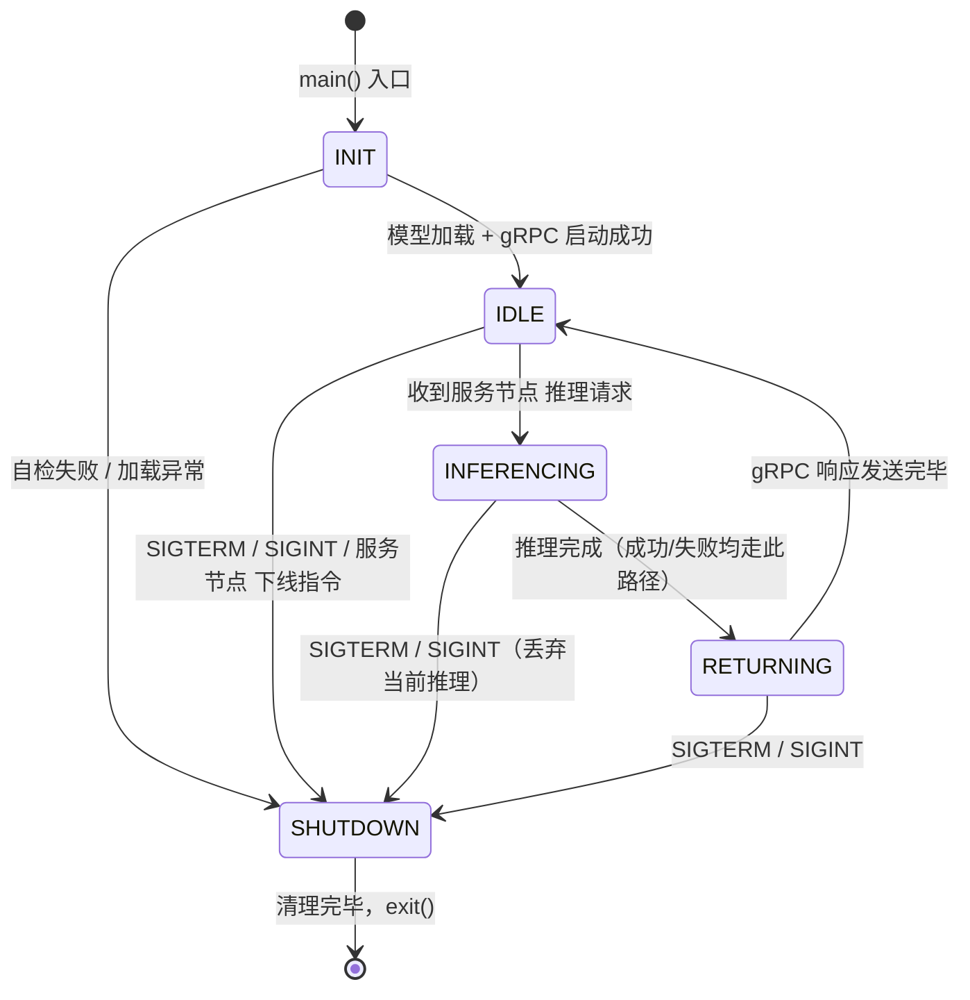

# 检测节点 设计方案 — AI 推理节点（Jetson Nano）

> 本文档是检测节点（AI 推理节点）的详细设计方案，面向开发者与 AI 编码助手。
> 上层架构规范见项目根目录 `AGENTS.md`，本文档仅包含检测节点 专属的设计细节。

> **⚠️ 项目阶段边界声明：本项目当前为"原型技术验证 Demo"阶段。**
> - 阶段目标仅为**验证端到端技术链路可行**（采集 → 推理 → 测量 → 显示）
> - 精度/延迟指标、流式推理、TensorRT/FP16、自动化测试等 **C 类要素本阶段一律不引入**
> - 本文档所有设计约定以"最快打通链路、可演示"为优先原则

---

## 目录

1. [节点职责与运行环境](#1-节点职责与运行环境)
2. [工程目录结构](#2-工程目录结构)
3. [核心模块与类设计](#3-核心模块与类设计)
4. [并发与线程模型](#4-并发与线程模型)
5. [配置加载与启动自检流程](#5-配置加载与启动自检流程)
6. [日志与异常处理策略](#6-日志与异常处理策略)
7. [节点生命周期与状态机设计](#7-节点生命周期与状态机设计)
8. [Systemd 部署与纯 CLI 交互](#8-systemd-部署与纯-cli-交互)

---

## 1. 节点职责与运行环境

### 1.1 节点定位

检测节点 是**专用 AI 计算节点**，在整个系统中承担唯一的职责：**接收服务节点 发送的 RGB 图像，执行 UNet 语义分割推理，返回类别掩码**。

```
[服务节点 主控] ──JPEG 帧──→ [检测节点 AI推理] ──PNG 掩码──→ [服务节点 主控]
                              │
                         UNet (ResNet50)
                         CUDA @ 640×640
```

### 1.2 职责边界（强制约束）

| 职责 | 是否归属检测节点 | 说明 |
|------|---------------|------|
| UNet 模型加载与前向推理 | **是** | 检测节点 唯一核心职责 |
| gRPC 服务端（接收请求、返回响应） | **是** | 通信层服务 |
| 启停与环境自检 | **是** | 启动门控 |
| 物理测量换算（直径/间距） | **否** | 属于服务节点 `measure` 模块 |
| 视频采集（336L 相机） | **否** | 属于服务节点 `camera` 模块 |
| 激光测距数据采集 | **否** | 属于服务节点 `serial` 模块 |
| GUI 渲染与用户交互 | **否** | 属于服务节点 `ui` 模块 |
| 深度图（Depth）处理 | **否** | 原型阶段不接入 |

**设计理由**：测量换算在数据使用方（服务节点）执行，检测节点 无需持有相机内参与传感器状态，保持无状态、可替换。gRPC 请求中携带的 `camera_distance_mm` 仅随帧记录（用于日志追溯与帧同步校验），不参与任何计算。

### 1.3 硬件环境

| 属性 | 说明 |
|------|------|
| 硬件 | NVIDIA Jetson Nano（Maxwell 架构 128 CUDA core，4GB 共享显存） |
| 操作系统 | Ubuntu 22.04 LTS（NVIDIA Jetson 官方定制内核，原生兼容 CUDA 生态） |
| CUDA 版本 | JetPack 自带 CUDA（通常 10.2+），需实测确认 |
| Python 版本 | Python 3.8+（Jetson 官方镜像自带） |
| PyTorch | Jetson 专用 wheel 安装（NVIDIA 官方提供，需对应 JetPack 版本） |

### 1.4 性能约束

- **4GB 共享显存**：CPU/GPU 共享内存，模型加载后余量有限，检测节点 **不应再承担其他服务**
- **推理模式**：按需尽力而为（服务节点 侧通过配置控制请求节奏，检测节点 侧不强制节流），不承诺逐帧实时
- **单帧耗时**：ResNet50-UNet @ 640x640 on CUDA，预计 1~3 秒（Jetson Nano 算力有限）
- **模型权重**：`logs/Unet_resnet50.pth`，约 100MB+ 量级，启动时一次性加载

### 1.5 推理节奏（控制权在服务节点）

原型阶段采用**按需触发**：用户确认测量时由服务节点 发送单次推理请求，不做逐帧连续推理。

**检测节点 侧不做任何时间间隔强制限制**——推理端以实测性能为上限，收到请求即刻执行推理，"能跑多少跑多少"。相邻两次推理请求之间的时间间隔控制**仅在服务节点 侧执行**，由服务节点 的配置文件 `config/inference.json` 中的 `inference_interval_seconds`（默认 3.0 秒）参数决定。

> 设计理由：检测节点 侧取消节流后，实测推理耗时长短只取决于 Jetson Nano 的实时负载，避免人为降效。间隔控制权上交服务节点 侧后，部署时可根据具体设备性能余量快速调整（修改配置文件即可，无需重烧系统），并在 UI 层给用户明确的节流反馈。

---

## 2. 工程目录结构

```
DEMO/
├── AGENTS.md                          # 项目总体架构规范（双节点共享）
├── docs/
│   ├── Design-AI_detect.md            # 本文档 — 检测节点 设计方案
│   └── Design-server.md               # 服务节点 设计方案
├── node_detect/                            # 检测节点 工程根目录
│   ├── __init__.py
│   ├── main.py                        # 入口：启动自检 → 启动 gRPC 服务 → 阻塞等待
│   ├── config/                        # 配置文件（检测节点 专属副本，统一 JSON 格式）
│   │   ├── network.json               # 网络参数：local_ip, remote_ip, grpc_port
│   │   ├── inference.json             # 推理参数：model_path, input_shape, cuda
│   │   └── service_unit.json          # systemd unit 参数源（部署时渲染为 INI）
│   ├── proto/                         # Protocol Buffers 定义与生成桩代码
│   │   ├── rebar_inference.proto     # gRPC 服务与消息定义
│   │   ├── rebar_inference_pb2.py    # protoc 生成的消息类
│   │   └── rebar_inference_pb2_grpc.py  # protoc 生成的服务桩
│   ├── inference/                     # 推理核心模块
│   │   ├── __init__.py
│   │   ├── model.py                   # UNet 模型定义（从 new-predict.py 迁移）
│   │   ├── predictor.py               # 推理器：预处理 → 前向 → 后处理
│   │   └── constants.py               # 分割类别常量、ImageNet 均值/方差
│   ├── grpc_server/                   # gRPC 服务端模块
│   │   ├── __init__.py
│   │   ├── servicer.py                # RebarInferenceServicer 实现
│   │   └── server_factory.py          # gRPC server 创建与生命周期管理
│   ├── system/                        # 系统级模块
│   │   ├── __init__.py
│   │   ├── config_loader.py           # JSON 配置文件加载与校验
│   │   ├── self_check.py              # 启动环境自检（IP / 端口 / CUDA）
│   │   └── logger.py                  # 全局日志初始化（一机一日志）
│   ├── logs/                          # 日志输出目录
│   │   └── node_detect.log                 # 检测节点 全局日志文件
│   ├── weights/                       # 模型权重目录
│   │   └── .gitkeep                   # 部署时人工放入 Unet_resnet50.pth
│   └── requirements.txt               # 检测节点 专属依赖清单（与 node_server/requirements.txt 对称）
├── node_server/                            # 服务节点 工程根目录（独立设计，不在本文档范围）
└── shared/                            # 共享常量与工具（双节点共用）
    └── constants.py                   # 帧格式常量、国标规格表等
```

### 目录设计说明

- `inference/`、`grpc_server/`、`system/` 严格按 AGENTS.md §3.1 的模块命名
- `proto/` 包含 `.proto` 源文件与生成的 `_pb2.py`、`_pb2_grpc.py`，确保双节点使用同一份 proto
- `config/` 仅放检测节点 需要的配置（网络 + 推理），不放相机/内参配置（属服务节点）
- `weights/` 目录在代码仓库中仅保留 `.gitkeep`，模型权重不入代码目录（见 AGENTS.md §8.4）
- 共享常量（帧格式、国标规格等）放 `shared/` 目录，通过 `sys.path` 或包引用

---

## 3. 核心模块与类设计

### 3.1 `inference/constants.py` — 分割类别与预处理常量

```python
"""
推理常量定义：分割类别、ImageNet 标准化参数。
单一来源，检测节点 与服务节点 共享同一份定义。
"""

from typing import Tuple, List

# 分割类别定义
CLASS_BACKGROUND: int = 0      # 背景
CLASS_REBAR_VERTICAL: int = 1  # 纵向钢筋
CLASS_REBAR_HORIZONTAL: int = 2  # 横向钢筋

NUM_CLASSES: int = 3

# 类别名称（用于日志与调试）
CLASS_NAMES: List[str] = ["背景", "纵向钢筋", "横向钢筋"]

# 推理输入尺寸（宽, 高）
INPUT_SIZE: Tuple[int, int] = (640, 640)

# ImageNet 均值与方差（预处理标准化用）
IMAGENET_MEAN: Tuple[float, float, float] = (0.485, 0.456, 0.406)
IMAGENET_STD: Tuple[float, float, float] = (0.229, 0.224, 0.225)
```

> **与现有代码的差异**：`new-predict.py` 的 `preprocess_input` 仅做 `/255.0`，缺少 ImageNet 均值/方差标准化。新实现必须补充标准化步骤，否则与训练时的预处理不一致，导致推理精度下降。

### 3.2 `inference/model.py` — UNet 模型定义

> **归档说明**：`new-predict.py` 已归档至 `temp/`，本节及后续章节中"从 `new-predict.py` 迁移"均指从归档版本迁移至 `node_detect/inference/` 模块。

**设计决策**：从 `new-predict.py` 整体迁移网络定义代码（`BasicBlock`、`BottleNeck`、`ResNet`、`UNetModel` 等），不做结构修改，仅做以下调整：

1. 删除 `VGG16` 相关代码（仅保留 `resnet50` backbone，减少代码量）
2. 删除 `onnx` 导出相关逻辑（原型阶段不需要）
3. 删除打印配置、颜色映射等可视化相关代码（检测节点 不做可视化）

```python
"""
UNet（ResNet50 backbone）模型定义。
从 new-predict.py 迁移，仅保留 ResNet50 backbone 推理所需的最小网络结构。
"""

import torch
import torch.nn as nn
import torch.nn.functional as F
from typing import Tuple

from inference.constants import NUM_CLASSES


def conv3x3(in_planes: int, out_planes: int, stride: int = 1,
            groups: int = 1, dilation: int = 1) -> nn.Conv2d:
    return nn.Conv2d(in_planes, out_planes, kernel_size=3, stride=stride,
                     padding=dilation, groups=groups, bias=False, dilation=dilation)


def conv1x1(in_planes: int, out_planes: int, stride: int = 1) -> nn.Conv2d:
    return nn.Conv2d(in_planes, out_planes, kernel_size=1, stride=stride, bias=False)


class Bottleneck(nn.Module):
    expansion: int = 4

    def __init__(self, inplanes: int, planes: int, stride: int = 1,
                 downsample: nn.Module = None) -> None:
        super().__init__()
        self.conv1 = conv1x1(inplanes, planes)
        self.bn1 = nn.BatchNorm2d(planes)
        self.conv2 = conv3x3(planes, planes, stride)
        self.bn2 = nn.BatchNorm2d(planes)
        self.conv3 = conv1x1(planes, planes * self.expansion)
        self.bn3 = nn.BatchNorm2d(planes * self.expansion)
        self.relu = nn.ReLU(inplace=True)
        self.downsample = downsample
        self.stride = stride

    def forward(self, x: torch.Tensor) -> torch.Tensor:
        identity = x
        out = self.relu(self.bn1(self.conv1(x)))
        out = self.relu(self.bn2(self.conv2(out)))
        out = self.bn3(self.conv3(out))
        if self.downsample is not None:
            identity = self.downsample(x)
        return self.relu(out + identity)


class ResNet(nn.Module):
    """ResNet50 backbone：输出 4 级特征图供 UNet 编码器使用。"""

    def __init__(self, block: nn.Module, layers: list) -> None:
        super().__init__()
        self.inplanes = 64
        self.conv1 = nn.Conv2d(3, 64, kernel_size=7, stride=2, padding=3, bias=False)
        self.bn1 = nn.BatchNorm2d(64)
        self.relu = nn.ReLU(inplace=True)
        self.maxpool = nn.MaxPool2d(kernel_size=3, stride=2, padding=1)
        self.layer1 = self._make_layer(block, 64, layers[0])    # 输出 1/4
        self.layer2 = self._make_layer(block, 128, layers[1], stride=2)  # 1/8
        self.layer3 = self._make_layer(block, 256, layers[2], stride=2)  # 1/16
        self.layer4 = self._make_layer(block, 512, layers[3], stride=2)  # 1/32

    def _make_layer(self, block: nn.Module, planes: int,
                    blocks: int, stride: int = 1) -> nn.Sequential:
        downsample = None
        if stride != 1 or self.inplanes != planes * block.expansion:
            downsample = nn.Sequential(
                conv1x1(self.inplanes, planes * block.expansion, stride),
                nn.BatchNorm2d(planes * block.expansion),
            )
        layers = [block(self.inplanes, planes, stride, downsample)]
        self.inplanes = planes * block.expansion
        for _ in range(1, blocks):
            layers.append(block(self.inplanes, planes))
        return nn.Sequential(*layers)

    def forward(self, x: torch.Tensor) -> Tuple[torch.Tensor, ...]:
        x = self.relu(self.bn1(self.conv1(x)))
        x = self.maxpool(x)
        feat1 = self.layer1(x)   # 256 channels
        feat2 = self.layer2(feat1)  # 512 channels
        feat3 = self.layer3(feat2)  # 1024 channels
        feat4 = self.layer4(feat3)  # 2048 channels
        return feat1, feat2, feat3, feat4


class UNetUp(nn.Module):
    """UNet 解码器上采样块：拼接 + 两次卷积。"""

    def __init__(self, in_size: int, out_size: int) -> None:
        super().__init__()
        self.up = nn.UpsamplingBilinear2d(scale_factor=2)
        self.conv = nn.Sequential(
            conv3x3(in_size, out_size),
            nn.ReLU(inplace=True),
            conv3x3(out_size, out_size),
            nn.ReLU(inplace=True),
        )

    def forward(self, low: torch.Tensor, high: torch.Tensor) -> torch.Tensor:
        up = self.up(high)
        # 尺寸对齐（处理奇偶差异）
        if up.shape[2:] != low.shape[2:]:
            up = F.interpolate(up, size=low.shape[2:], mode='bilinear', align_corners=False)
        return self.conv(torch.cat([low, up], dim=1))


class UNetModel(nn.Module):
    """UNet 分割网络：ResNet50 encoder + UNet decoder。"""

    def __init__(self, num_classes: int = NUM_CLASSES) -> None:
        super().__init__()
        self.resnet = ResNet(Bottleneck, [3, 4, 6, 3])  # ResNet50
        in_filters = [256, 512, 1024, 2048]  # ResNet50 4 级特征通道数
        out_filters = [64, 128, 256, 512]
        self.up4 = UNetUp(in_filters[3] + out_filters[3], out_filters[3])
        self.up3 = UNetUp(in_filters[2] + out_filters[3], out_filters[2])
        self.up2 = UNetUp(in_filters[1] + out_filters[2], out_filters[1])
        self.up1 = UNetUp(in_filters[0] + out_filters[1], out_filters[0])
        self.up_conv = nn.Sequential(
            nn.UpsamplingBilinear2d(scale_factor=2),
            conv3x3(out_filters[0], out_filters[0]),
            nn.ReLU(inplace=True),
            conv3x3(out_filters[0], out_filters[0]),
            nn.ReLU(inplace=True),
        )
        self.final = nn.Conv2d(out_filters[0], num_classes, kernel_size=1)

    def forward(self, inputs: torch.Tensor) -> torch.Tensor:
        feat1, feat2, feat3, feat4 = self.resnet(inputs)
        up4 = self.up4(feat3, feat4)
        up3 = self.up3(feat2, up4)
        up2 = self.up2(feat1, up3)
        up1 = self.up1(feat1, up2)
        up1 = self.up_conv(up1)
        return self.final(up1)
```

> **注意**：上述 `UNetUp` 与 `UNetModel` 的实现与原 `new-predict.py` 有细微差异。原版的 `unetUp` 输入通道数标注为 `[192, 512, 1024, 3072]` 与实际 ResNet50 输出不一致——这里已修正为 ResNet50 实际通道数。迁移时需逐层核对通道维度，确保拼接操作维度对齐。

### 3.3 `inference/predictor.py` — 推理器

这是检测节点 的核心推理类，封装完整的「预处理 → GPU 推扫 → 后处理」流水线。

```python
"""
推理器：封装 UNet 推理的完整流水线。
单次推理耗时预计 1~3 秒（Jetson Nano CUDA）。
"""

import io
import logging
from typing import Optional, Tuple

import cv2
import numpy as np
import torch
import torch.nn.functional as F
from PIL import Image

from inference.model import UNetModel
from inference.constants import (
    NUM_CLASSES, INPUT_SIZE, IMAGENET_MEAN, IMAGENET_STD, CLASS_NAMES
)

logger = logging.getLogger("node_detect.inference")


class RebarPredictor:
    """
    UNet 钢筋分割推理器。

    职责：加载权重 → 预处理 JPEG 帧 → CUDA 推理 → 后处理 → 输出 uint8 掩码。
    做无状态设计：每次 infer() 独立，不缓存中间结果。
    """

    def __init__(self, model_path: str, use_cuda: bool = True) -> None:
        """
        初始化推理器。

        Args:
            model_path: 权重文件绝对路径，如 "/home/jetson/node_detect/weights/Unet_resnet50.pth"
            use_cuda: 是否使用 CUDA 推理。Jetson Nano 上必须为 True。

        Raises:
            FileNotFoundError: 权重文件不存在
            RuntimeError: CUDA 不可用但 use_cuda=True
        """
        self._model_path: str = model_path
        self._use_cuda: bool = use_cuda
        self._input_size: Tuple[int, int] = INPUT_SIZE  # (640, 640)

        # --- 初始化设备 ---
        if self._use_cuda and not torch.cuda.is_available():
            raise RuntimeError(
                f"配置启用 CUDA 但 torch.cuda.is_available()=False。"
                f"请检查 Jetson PyTorch 安装。"
            )
        self._device = torch.device("cuda" if self._use_cuda else "cpu")
        logger.info(f"推理设备: {self._device}")

        # --- 加载模型 ---
        self._model = UNetModel(num_classes=NUM_CLASSES)
        try:
            state_dict = torch.load(self._model_path, map_location=self._device)
            self._model.load_state_dict(state_dict)
        except FileNotFoundError:
            logger.error(f"权重文件未找到: {self._model_path}")
            raise
        except RuntimeError as e:
            logger.error(f"权重加载失败（可能结构不匹配）: {e}")
            raise

        self._model.to(self._device)
        self._model.eval()
        logger.info(f"模型加载成功: {self._model_path}")

    def infer(self, jpeg_bytes: bytes) -> Optional[Tuple[np.ndarray, int, int]]:
        """
        执行单帧推理。

        Args:
            jpeg_bytes: JPEG 编码的 RGB 图像字节流（来自服务节点）。

        Returns:
            (mask, width, height) 三元组：
                - mask: uint8 数组，取值 0/1/2，shape=(height, width)
                - width: 原图宽度
                - height: 原图高度
            推理失败返回 None。
        """
        try:
            # 1. 解码 JPEG → PIL Image
            image = self._decode_jpeg(jpeg_bytes)
            if image is None:
                return None

            orig_w, orig_h = image.size
            logger.debug(f"输入图像尺寸: {orig_w}x{orig_h}")

            # 2. 预处理：letterbox 缩放 + ImageNet 标准化 → [1,3,640,640] 张量
            tensor, nw, nh = self._preprocess(image)

            # 3. 前向推理
            with torch.no_grad():
                tensor = tensor.to(self._device)
                output = self._model(tensor)   # [1, 3, H, W] logits

            # 4. 后处理：softmax → 裁剪灰边 → 插值回原图 → argmax → uint8 mask
            mask = self._postprocess(output, nw, nh, orig_w, orig_h)

            # 5. 统计类别分布（DEBUG 级别日志）
            unique, counts = np.unique(mask, return_counts=True)
            for cls_id, cnt in zip(unique, counts):
                logger.debug(f"类别 {cls_id}（{CLASS_NAMES[cls_id]}）: {cnt} px")

            return mask, orig_w, orig_h

        except Exception as e:
            logger.error(f"推理异常: {e}", exc_info=True)
            return None

    # ---------------- 私有方法 ----------------

    @staticmethod
    def _decode_jpeg(jpeg_bytes: bytes) -> Optional[Image.Image]:
        """解码 JPEG 字节流为 PIL Image（RGB）。"""
        try:
            buf = io.BytesIO(jpeg_bytes)
            image = Image.open(buf).convert("RGB")
            return image
        except Exception as e:
            logger.error(f"JPEG 解码失败: {e}")
            return None

    def _preprocess(self, image: Image.Image) -> Tuple[torch.Tensor, int, int]:
        """
        预处理流水线：
        1. Letterbox 缩放装入 640×640（灰边填充）
        2. 归一化到 [0,1] + ImageNet 均值/方差标准化
        3. 转 [1, 3, 640, 640] 张量

        Returns:
            (tensor, nw, nh) — nw/nh 为缩放后实际图像区域（不含灰边），供后处理裁剪用。
        """
        target_w, target_h = self._input_size

        # Letterbox 缩放
        orig_w, orig_h = image.size
        scale = min(target_w / orig_w, target_h / orig_h)
        nw = int(orig_w * scale)
        nh = int(orig_h * scale)
        resized = image.resize((nw, nh), Image.BICUBIC)

        # 灰边填充至目标尺寸
        new_image = Image.new("RGB", (target_w, target_h), (128, 128, 128))
        new_image.paste(resized, ((target_w - nw) // 2, (target_h - nh) // 2))

        # numpy → 归一化 → ImageNet 标准化 → 张量
        img_array = np.array(new_image, dtype=np.float32) / 255.0  # [0, 1]
        mean = np.array(IMAGENET_MEAN, dtype=np.float32)
        std = np.array(IMAGENET_STD, dtype=np.float32)
        img_array = (img_array - mean) / std  # ImageNet 标准化

        # [H, W, C] → [C, H, W] → [1, C, H, W]
        tensor = torch.from_numpy(img_array.transpose(2, 0, 1)).unsqueeze(0)
        return tensor, nw, nh

    @staticmethod
    def _postprocess(
        output: torch.Tensor,
        nw: int, nh: int,
        orig_w: int, orig_h: int
    ) -> np.ndarray:
        """
        后处理流水线：
        1. Softmax → 概率图
        2. 裁剪灰边区域（保留实际图像区域）
        3. 插值放大回原图尺寸
        4. argmax → 类别掩码

        Returns:
            uint8 数组，shape=(orig_h, orig_w)，取值 0/1/2。
        """
        # output: [1, C, H, W] → softmax → [H, W, C]
        prob = F.softmax(output, dim=1)  # [1, C, H, W]
        prob = prob.squeeze(0).permute(1, 2, 0).cpu().numpy()  # [H, W, C]

        inp_h, inp_w = prob.shape[:2]  # 640, 640

        # 裁剪灰边区域
        top = (inp_h - nh) // 2
        left = (inp_w - nw) // 2
        crop = prob[top: top + nh, left: left + nw, :]

        # 插值回原图尺寸
        mask_prob = cv2.resize(crop, (orig_w, orig_h), interpolation=cv2.INTER_LINEAR)

        # argmax → 类别
        mask = mask_prob.argmax(axis=-1).astype(np.uint8)  # [orig_h, orig_w]
        return mask

    @property
    def is_ready(self) -> bool:
        """推理器是否就绪（模型已加载）。"""
        return hasattr(self, '_model') and self._model is not None
```

### 3.4 `grpc_server/servicer.py` — gRPC 服务实现

```python
"""
gRPC 服务实现：RebarInference 的 Infer 方法与 Heartbeat 方法。

请求-响应流程：
  1. Infer：解析 InferRequest（JPEG 帧 + frame_id + timestamp + distance）
  2.       调用 RebarPredictor.infer() 获取掩码
  3.       将掩码编码为 PNG 字节
  4.       构造 InferResponse 返回（内嵌当前 status 状态）
  5. Heartbeat：接收心跳包，写入时间戳，返回确认
"""

import logging
import time
from typing import Optional

import cv2
import numpy as np

from inference.predictor import RebarPredictor

# 生成的桩代码（需先 protoc 编译）
from proto import rebar_inference_pb2 as pb2
from proto import rebar_inference_pb2_grpc import RebarInferenceServicer

logger = logging.getLogger("node_detect.grpc_server")


class RebarInferenceServicer(RebarInferenceServicer):
    """
    RebarInference gRPC 服务实现。

    每个 Infer 请求独立处理，检测节点 不做请求排队或批处理。
    服务节点 端已在 gRPC channel 层设置 deadline，超时由 gRPC 框架自动取消。
    """

    def __init__(self, predictor: RebarPredictor) -> None:
        """
        Args:
            predictor: 已就绪的 RebarPredictor 实例。
        """
        super().__init__()
        self._predictor = predictor

    def Infer(self, request: pb2.InferRequest, context) -> pb2.InferResponse:
        """
        执行单帧推理并返回分割掩码。

        流程伪代码：
        ```
        接收请求:
            frame_id   = request.frame_id
            timestamp  = request.timestamp_ms
            distance   = request.camera_distance_mm   # 仅记录，不参与计算
            jpeg_bytes = request.image

        日志记录: frame_id, timestamp, distance（随帧绑定追溯）

        result = predictor.infer(jpeg_bytes)
        if result is None:
            return error (掩码为空)

        mask, width, height = result
        png_bytes = encode_png(mask)

        return InferResponse(
            label_mask = png_bytes,
            frame_id   = frame_id,       # 回传请求 frame_id
            timestamp_ms = timestamp,    # 回传请求时间戳
            width  = width,
            height = height,
        )
        ```

        错误处理：
        - 推理失败：记录 ERROR 日志，返回空掩码（width=0, height=0）
        - 不抛出异常到 gRPC 框架（避免连接中断），以服务端内部错误码处理
        """
        t_start = time.time()
        frame_id = request.frame_id
        timestamp_ms = request.timestamp_ms
        distance_mm = request.camera_distance_mm

        logger.info(
            f"收到推理请求: frame_id={frame_id}, timestamp={timestamp_ms}ms, "
            f"distance={distance_mm}mm, image_size={len(request.image)} bytes"
        )

        # 记录距离标量（不参与计算，仅供追溯与帧同步校验）
        logger.debug(f"帧 {frame_id} 绑定的激光测距值: {distance_mm}mm")

        # 执行推理
        result: Optional[tuple] = self._predictor.infer(request.image)

        if result is None:
            logger.error(f"推理失败: frame_id={frame_id}，返回空响应")
            return pb2.InferResponse(
                label_mask=b"",
                frame_id=frame_id,
                timestamp_ms=timestamp_ms,
                width=0,
                height=0,
            )

        mask, width, height = result

        # 编码掩码为 PNG 字节
        try:
            success, png_bytes = cv2.imencode('.png', mask)
            if not success:
                raise RuntimeError("cv2.imencode PNG 失败")
            png_data = png_bytes.tobytes()
        except Exception as e:
            logger.error(f"掩码 PNG 编码失败: frame_id={frame_id}, error={e}")
            return pb2.InferResponse(
                label_mask=b"",
                frame_id=frame_id,
                timestamp_ms=timestamp_ms,
                width=0,
                height=0,
            )

        elapsed_ms = (time.time() - t_start) * 1000
        logger.info(
            f"推理完成: frame_id={frame_id}, "
            f"mask={width}x{height}, png_size={len(png_data)} bytes, "
            f"耗时={elapsed_ms:.1f}ms"
        )

        return pb2.InferResponse(
            label_mask=png_data,
            frame_id=frame_id,
            timestamp_ms=timestamp_ms,
            width=width,
            height=height,
            status=self._state_machine.current_proto_status(),
        )

    def Heartbeat(self, request, context):
        """接收心跳包（来自服务节点 的 KeepAlive 探针）。

        极简处理：仅记录日志 + 返回时间戳。
        不含任何重逻辑、不读共享变量（服务节点 不需要检测节点 响应其 KeepAlive）。
        """
        logger.info(
            f"Heartbeat: node={request.node_id} "
            f"ts={request.timestamp_ms} status={request.status}"
        )
        return pb2.HeartbeatResponse(
            accepted=True,
            server_timestamp_ms=int(time.time() * 1000),
        )
```

### 3.5 `grpc_server/server_factory.py` — gRPC 服务端生命周期

```python
"""
gRPC 服务端创建与生命周期管理。

单线程同步服务器（无流式调用），使用 ThreadPoolExecutor
处理并发请求。检测节点 侧不设请求间隔限制，线程池提供请求执行层面的并发保护。
"""

import logging
from concurrent import futures
from typing import Optional

import grpc

from grpc_server.servicer import RebarInferenceServicer
from inference.predictor import RebarPredictor

# 生成的桩代码
from proto import rebar_inference_pb2_grpc as pb2_grpc

logger = logging.getLogger("node_detect.grpc_server")


class GRPCServer:
    """
    gRPC 服务端封装。

    生命周期：create() → start() → wait_for_termination() → stop()
    """

    def __init__(
        self,
        predictor: RebarPredictor,
        listen_address: str,   # 如 "0.0.0.0:50051"
        max_workers: int = 4,  # 线程池大小（原型阶段 4 足够）
    ) -> None:
        """
        Args:
            predictor: 已就绪的 RebarPredictor 实例。
            listen_address: 监听地址，格式 "IP:PORT" 或 "0.0.0.0:PORT"。
            max_workers: 线程池工作线程数。
        """
        self._predictor = predictor
        self._listen_address = listen_address
        self._max_workers = max_workers
        self._server: Optional[grpc.Server] = None

    def start(self) -> None:
        """
        创建并启动 gRPC 服务。

        伪代码：
        ```
        servicer = RebarInferenceServicer(predictor)
        server = grpc.server(ThreadPoolExecutor(max_workers))
        add_servicer_to_server(servicer, server)
        server.add_insecure_port(listen_address)
        server.start()
        log: "gRPC 服务已启动，监听 {listen_address}"
        ```
        """
        servicer = RebarInferenceServicer(self._predictor)
        self._server = grpc.server(
            futures.ThreadPoolExecutor(max_workers=self._max_workers)
        )
        pb2_grpc.add_RebarInferenceServicer_to_server(servicer, self._server)
        self._server.add_insecure_port(self._listen_address)
        self._server.start()
        logger.info(f"gRPC 服务已启动，监听 {self._listen_address}")

    def wait_for_termination(self) -> None:
        """阻塞当前线程，直到服务终止。"""
        if self._server:
            self._server.wait_for_termination()

    def stop(self, grace: float = 5.0) -> None:
        """
        优雅停止 gRPC 服务。

        Args:
            grace: 等待现有 RPC 完成的宽限期（秒）。
        """
        if self._server:
            self._server.stop(grace)
            logger.info("gRPC 服务已停止")
```

### 3.6 `system/config_loader.py` — 配置加载

```python
"""
JSON 配置文件加载与校验。

读取 config/network.json 与 config/inference.json，
合并为统一的 AppConfig 数据对象。
"""

import json
import logging
import os
from dataclasses import dataclass, field
from typing import Any, Dict

logger = logging.getLogger("node_detect.system")


@dataclass
class AppConfig:
    """检测节点 完整配置。"""

    # network.json 字段
    local_ip: str = ""
    remote_ip: str = ""
    grpc_port: int = 50051

    # inference.json 字段
    model_path: str = ""
    input_width: int = 640
    input_height: int = 640
    use_cuda: bool = True

    # 日志配置
    log_dir: str = "logs"
    log_level: str = "INFO"
    log_file: str = "node_detect.log"


def load_config(config_dir: str) -> AppConfig:
    """
    加载并校验配置文件。

    Args:
        config_dir: 配置目录绝对路径。

    Returns:
        填充好的 AppConfig 实例。

    Raises:
        FileNotFoundError: 配置文件不存在
        KeyError: 缺少必要字段
        ValueError: 字段值无效（如端口号超出范围）

    伪代码：
    ```
    network_conf = read_json(config_dir/network.json)
    inference_conf = read_json(config_dir/inference.json)

    merge into AppConfig

    validate:
        - grpc_port in (1024, 65535)
        - input_width > 0 and input_height > 0
        - use_cuda is bool
        - local_ip is valid IPv4 format

    return config
    """
    network_path = os.path.join(config_dir, "network.json")
    inference_path = os.path.join(config_dir, "inference.json")

    if not os.path.isfile(network_path):
        raise FileNotFoundError(f"网络配置文件不存在: {network_path}")
    if not os.path.isfile(inference_path):
        raise FileNotFoundError(f"推理配置文件不存在: {inference_path}")

    with open(network_path, "r", encoding="utf-8") as f:
        net_conf: Dict[str, Any] = json.load(f)
    with open(inference_path, "r", encoding="utf-8") as f:
        inf_conf: Dict[str, Any] = json.load(f)

    config = AppConfig(
        local_ip=net_conf["local_ip"],
        remote_ip=net_conf["remote_ip"],
        grpc_port=int(net_conf["grpc_port"]),
        model_path=inf_conf["model_path"],
        input_width=int(inf_conf.get("input_width", 640)),
        input_height=int(inf_conf.get("input_height", 640)),
        use_cuda=bool(inf_conf.get("use_cuda", True)),
        log_dir=inf_conf.get("log_dir", "logs"),
        log_level=inf_conf.get("log_level", "INFO"),
        log_file=inf_conf.get("log_file", "node_detect.log"),
    )

    # 校验
    if not (1024 <= config.grpc_port <= 65535):
        raise ValueError(f"gRPC 端口号无效: {config.grpc_port}（有效范围 1024-65535）")
    if config.input_width <= 0 or config.input_height <= 0:
        raise ValueError(f"输入尺寸无效: {config.input_width}x{config.input_height}")
    if not _is_valid_ipv4(config.local_ip):
        raise ValueError(f"本机 IP 格式无效: {config.local_ip}")
    if not _is_valid_ipv4(config.remote_ip):
        raise ValueError(f"对端 IP 格式无效: {config.remote_ip}")

    # 检查权重文件是否存在
    if not os.path.isfile(config.model_path):
        raise FileNotFoundError(f"模型权重文件不存在: {config.model_path}")

    logger.info(f"配置加载成功: local_ip={config.local_ip}, "
                f"grpc_port={config.grpc_port}, model={config.model_path}")
    return config


def _is_valid_ipv4(ip: str) -> bool:
    """简单的 IPv4 格式校验。"""
    parts = ip.split(".")
    if len(parts) != 4:
        return False
    try:
        return all(0 <= int(p) <= 255 for p in parts)
    except ValueError:
        return False
```

### 3.7 `system/self_check.py` — 启动环境自检

```python
"""
启动环境自检。

在 gRPC 服务启动前同步执行，不通过则安全退出进程。
检查项：root 权限、本机 IP 一致性、端口可用性、CUDA 可用性、模型权重可加载性。
"""

import logging
import os
import socket
import subprocess
import sys
from typing import Tuple

import torch

from system.config_loader import AppConfig

logger = logging.getLogger("node_detect.system")


class SelfCheckError(Exception):
    """自检失败异常，携带失败原因。"""
    pass


def run_self_check(config: AppConfig) -> Tuple[bool, str]:
    """
    执行完整的启动环境自检。

    Args:
        config: 已加载的应用配置。

    Returns:
        (passed, message) — passed=True 表示全部通过。

    Raises:
        SelfCheckError: 硬故障（非 root / IP 不匹配 / 端口占用 / CUDA 不可用），需安全退出。

    伪代码：
    ```
    passed = True
    messages = []

    # 检查 0：root 权限
    if os.geteuid() != 0:
        raise SelfCheckError("未以 root 权限运行，无法配置 Jetson 设备与访问 GPIO")

    # 检查 1：本机 IP 校验
    actual_ip = get_local_ip(config.local_ip)
    if actual_ip != config.local_ip:
        raise SelfCheckError(f"本机 IP 不匹配: 期望 {config.local_ip}, 实际 {actual_ip}")

    # 检查 2：端口可用性
    if not check_port_available(config.grpc_port):
        raise SelfCheckError(f"端口 {config.grpc_port} 已被占用")

    # 检查 3：CUDA 可用性（如果 use_cuda=True）
    if config.use_cuda:
        if not torch.cuda.is_available():
            raise SelfCheckError("CUDA 不可用但配置要求启用 CUDA")
        log GPU info: name, memory

    # 检查 4：模型权重文件可加载性（仅检查文件存在与可读，不实际加载）
    if not os.access(config.model_path, os.R_OK):
        raise SelfCheckError(f"模型权重文件不可读: {config.model_path}")

    return True
    """
    messages = []

    # === 检查 0：root 权限 ===
    logger.info("自检: root 权限...")
    if not _check_root_privilege():
        msg = ("未以 root 权限运行（os.geteuid()=%d）。检测节点 需要 root 权限："
               "（1）访问 GPU 设备节点 /dev/nvidia*；"
               "（2）设置 systemd 服务；（3）绑定低位端口（如未来需要）。\n"
               "请使用 sudo 运行或通过 systemd User=root 启动。") % os.geteuid()
        logger.error(msg)
        raise SelfCheckError(msg)
    logger.info("root 权限检查通过 (euid=0)")
    messages.append("root 权限 ✓")

    # === 检查 1：本机 IP 校验 ===
    logger.info("自检: 本机 IP 校验...")
    try:
        actual_ip = _get_local_ip_for(config.local_ip)
        if actual_ip != config.local_ip:
            msg = (f"本机 IP 不匹配: 配置文件为 {config.local_ip}, "
                   f"实际网卡 IP 为 {actual_ip}。请检查网络配置脚本是否已执行。")
            logger.error(msg)
            raise SelfCheckError(msg)
        logger.info(f"本机 IP 校验通过: {actual_ip}")
        messages.append(f"本机 IP: {actual_ip} ✓")
    except SelfCheckError:
        raise
    except Exception as e:
        msg = f"本机 IP 校验异常: {e}"
        logger.error(msg)
        raise SelfCheckError(msg)

    # === 检查 2：端口可用性 ===
    logger.info("自检: 端口可用性...")
    if not _check_port_available("0.0.0.0", config.grpc_port):
        msg = f"gRPC 端口 {config.grpc_port} 已被占用，无法启动服务。"
        logger.error(msg)
        raise SelfCheckError(msg)
    logger.info(f"端口 {config.grpc_port} 可用")
    messages.append(f"端口 {config.grpc_port} ✓")

    # === 检查 3：CUDA 可用性 ===
    if config.use_cuda:
        logger.info("自检: CUDA 可用性...")
        if not torch.cuda.is_available():
            msg = "配置要求启用 CUDA，但 torch.cuda.is_available()=False。请检查 JetPy Torch 安装。"
            logger.error(msg)
            raise SelfCheckError(msg)
        gpu_name = torch.cuda.get_device_name(0)
        gpu_mem = torch.cuda.get_device_properties(0).total_mem / (1024 ** 3)
        logger.info(f"CUDA 可用: {gpu_name}, 显存 {gpu_mem:.1f} GB")
        messages.append(f"CUDA: {gpu_name} ({gpu_mem:.1f} GB) ✓")
    else:
        logger.warning("CUDA 已禁用，推理将使用 CPU（性能严重下降）")
        messages.append("CUDA: 已禁用（CPU 模式）")

    # === 检查 4：模型权重可加载性 ===
    logger.info("自检: 模型权重文件...")
    if not os.access(config.model_path, os.R_OK):
        msg = f"模型权重文件不可读: {config.model_path}"
        logger.error(msg)
        raise SelfCheckError(msg)
    file_size_mb = os.path.getsize(config.model_path) / (1024 * 1024)
    logger.info(f"模型权重: {config.model_path} ({file_size_mb:.1f} MB)")
    messages.append(f"模型权重: {os.path.basename(config.model_path)} ({file_size_mb:.1f} MB) ✓")

    return True, "; ".join(messages)


def _get_local_ip_for(expected_ip: str) -> str:
    """
    获取本机与 expected_ip 所在网卡的 IPv4 地址。

    跨平台实现：
    - Linux: 使用 `hostname -I` 或 `ip addr` 解析
    - 通用 fallback: UDP 连接法（不发送数据，仅获取出口 IP）
    """
    # UDP 连接法（最通用）：向目标 IP 发 0 字节 UDP 获取出口 IP
    try:
        s = socket.socket(socket.AF_INET, socket.SOCK_DGRAM)
        s.connect((expected_ip, 80))
        local_ip = s.getsockname()[0]
        s.close()
        return local_ip
    except Exception:
        pass

    # Linux fallback: hostname -I
    try:
        result = subprocess.run(
            ["hostname", "-I"], capture_output=True, text=True, timeout=5
        )
        ips = result.stdout.strip().split()
        if expected_ip in ips:
            return expected_ip
        return ips[0] if ips else ""
    except Exception:
        return ""


def _check_port_available(host: str, port: int) -> bool:
    """检查指定端口是否可用（未被占用）。"""
    try:
        s = socket.socket(socket.AF_INET, socket.SOCK_STREAM)
        s.settimeout(2)
        s.bind((host, port))
        s.close()
        return True
    except OSError:
        return False


def _check_root_privilege() -> bool:
    """
    检查当前进程是否以 root 权限运行。

    Returns:
        True if euid == 0（root）。

    说明：
    - Linux 下 os.geteuid() 返回有效用户 ID；root 为 0。
    - Windows 下该检查无意义（检测节点 不运行于 Windows），始终返回 True。
    """
    try:
        return os.geteuid() == 0
    except AttributeError:
        # Windows 无 geteuid — 检测节点 不运行于此，安全放行
        return True
```

### 3.8 `system/logger.py` — 全局日志初始化

```python
"""
全局日志初始化（一机一日志）。

检测节点 所有模块统一写入 logs/node_detect.log。
格式：时间戳(毫秒) | 级别 | 节点 | 模块 | 消息
"""

import logging
import os
from logging.handlers import RotatingFileHandler
from typing import Optional


NODE_NAME: str = "A"


def init_logger(
    log_dir: str,
    log_file: str,
    log_level: str = "INFO",
    max_bytes: int = 10 * 1024 * 1024,  # 10 MB
    backup_count: int = 5,
) -> None:
    """
    初始化检测节点 全局日志。

    配置：
    - 文件输出：RotatingFileHandler，自动轮转
    - 控制台输出：StreamHandler（开发调试用）
    - 统一格式：%(asctime)s | %(levelname)s | D | %(name)s | %(message)s

    Args:
        log_dir: 日志目录路径。
        log_file: 日志文件名（如 "node_detect.log"）。
        log_level: 日志级别字符串（DEBUG/INFO/WARNING/ERROR/CRITICAL）。
        max_bytes: 单个日志文件最大字节数。
        backup_count: 保留的历史日志文件数。
    """
    os.makedirs(log_dir, exist_ok=True)
    log_path = os.path.join(log_dir, log_file)

    # 根日志器
    root_logger = logging.getLogger("node_detect")
    root_logger.setLevel(getattr(logging, log_level.upper(), logging.INFO))

    # 避免重复初始化（追加 handler）
    if root_logger.handlers:
        root_logger.handlers.clear()

    # 格式
    formatter = logging.Formatter(
        fmt="%(asctime)s.%(msecs)03d | %(levelname)s | %(node)s | %(name)s | %(message)s",
        datefmt="%Y-%m-%d %H:%M:%S",
    )

    # 添加自定义过滤器注入 NODE 字段
    class NodeFilter(logging.Filter):
        def filter(self, record: logging.LogRecord) -> bool:
            record.node = NODE_NAME
            return True

    node_filter = NodeFilter()

    # 文件 handler（轮转）
    file_handler = RotatingFileHandler(
        log_path, maxBytes=max_bytes, backupCount=backup_count,
        encoding="utf-8"
    )
    file_handler.setFormatter(formatter)
    file_handler.addFilter(node_filter)
    root_logger.addHandler(file_handler)

    # 控制台 handler
    console_handler = logging.StreamHandler()
    console_handler.setFormatter(formatter)
    console_handler.addFilter(node_filter)
    root_logger.addHandler(console_handler)

    root_logger.info(f"日志系统初始化完成: {log_path}")


def get_logger(module_name: str) -> logging.Logger:
    """
    获取模块级日志器。

    Args:
        module_name: 模块名，如 "inference.predictor"、"grpc_server.servicer"、"system.self_check"。

    Returns:
        logging.Logger 实例，日志名称为 "node_detect.{module_name}"。
    """
    return logging.getLogger(f"node_detect.{module_name}")
```

### 3.9 `main.py` — CLI 子命令路由（简化预览）

> **注意**：本节为旧版简化入口，完整版已重构为 CLI 子命令路由形式（见 §8.2）。
> 本节仅作快速预览，实际实现以 §8.2 为准。

```python
"""
检测节点 主入口。

启动流程：
1. 加载配置
2. 初始化日志
3. 执行环境自检（失败则安全退出）
4. 加载模型
5. 启动 gRPC 服务
6. 阻塞等待终止信号
"""

import logging
import os
import signal
import sys

from system.config_loader import load_config
from system.logger import init_logger
from system.self_check import run_self_check, SelfCheckError
from inference.predictor import RebarPredictor
from grpc_server.server_factory import GRPCServer

logger = logging.getLogger("node_detect.main")


def main() -> None:
    # --- 确定工程根目录 ---
    project_dir = os.path.dirname(os.path.abspath(__file__))
    config_dir = os.path.join(project_dir, "config")

    # --- 1. 加载配置 ---
    try:
        config = load_config(config_dir)
    except (FileNotFoundError, KeyError, ValueError) as e:
        print(f"[FATAL] 配置加载失败: {e}")
        sys.exit(1)

    # --- 2. 初始化日志 ---
    init_logger(
        log_dir=os.path.join(project_dir, config.log_dir),
        log_file=config.log_file,
        log_level=config.log_level,
    )

    logger.info("=" * 60)
    logger.info("检测节点（AI 推理节点）启动中...")
    logger.info("=" * 60)

    # --- 3. 环境自检 ---
    try:
        passed, check_msg = run_self_check(config)
        logger.info(f"环境自检通过: {check_msg}")
    except SelfCheckError as e:
        logger.critical(f"环境自检失败，安全退出: {e}")
        sys.exit(1)

    # --- 4. 加载模型 ---
    try:
        predictor = RebarPredictor(
            model_path=config.model_path,
            use_cuda=config.use_cuda,
        )
    except (FileNotFoundError, RuntimeError) as e:
        logger.critical(f"模型加载失败，安全退出: {e}")
        sys.exit(1)

    # --- 5. 启动 gRPC 服务 ---
    listen_addr = f"0.0.0.0:{config.grpc_port}"
    grpc_server = GRPCServer(
        predictor=predictor,
        listen_address=listen_addr,
        max_workers=4,
    )

    grpc_server.start()
    logger.info(f"检测节点 已就绪，等待服务节点 连接...")

    # --- 6. 注册信号处理，优雅退出 ---
    def _signal_handler(signum, frame):
        logger.info(f"收到信号 {signum}，正在停止服务...")
        grpc_server.stop(grace=5.0)
        logger.info("检测节点 已退出")
        sys.exit(0)

    signal.signal(signal.SIGINT, _signal_handler)
    signal.signal(signal.SIGTERM, _signal_handler)

    # --- 7. 阻塞 ---
    grpc_server.wait_for_termination()


if __name__ == "__main__":
    main()
```

### 3.10 `proto/rebar_inference.proto` — gRPC 协议定义

```proto
syntax = "proto3";

package rebar.inference;

// 钢筋分割推理服务（含心跳接口）
service RebarInference {
  rpc Infer(InferRequest) returns (InferResponse);
  rpc Heartbeat(HeartbeatRequest) returns (HeartbeatResponse);
}

message InferRequest {
  bytes image = 1;                 // JPEG 编码的 RGB 帧
  uint32 frame_id = 2;             // 帧序号（单调递增），帧同步主键
  int64 timestamp_ms = 3;          // 采集时刻时间戳（毫秒），帧同步辅助校验
  double camera_distance_mm = 4;   // 拍摄距离标量（激光测距值），随帧绑定
}

message InferResponse {
  bytes label_mask = 1;        // PNG 编码的单通道 0/1/2 类别掩码
  uint32 frame_id = 2;         // 回传请求 frame_id，帧同步主键
  int64 timestamp_ms = 3;      // 回传请求时间戳，供帧同步校验
  uint32 width = 4;            // 掩码宽（与原图一致）
  uint32 height = 5;           // 掩码高（与原图一致）
  NodeStatus status = 6;       // 节点当前状态（闲/忙/退出中）— 状态捎带
}

// ---- 心跳包（极简，A → B 单向推送） ----
message HeartbeatRequest {
  string node_id = 1;          // 节点标识 "node-detect"
  int64 timestamp_ms = 2;      // 发送时刻（毫秒时间戳）
  NodeStatus status = 3;       // 节点当前工作状态
  uint32 infer_count = 4;      // 累计推理成功次数（监控用）
  uint32 last_infer_duration_ms = 5;  // 最近一次推理耗时毫秒（性能观测）
}

message HeartbeatResponse {
  bool accepted = 1;           // 服务端是否受理
  int64 server_timestamp_ms = 2;  // 服务端接收时刻（时钟漂移校验）
}

// ---- 节点工作状态枚举 ----
enum NodeStatus {
  NODE_STATUS_UNKNOWN = 0;
  NODE_STATUS_IDLE = 1;
  NODE_STATUS_BUSY = 2;
  NODE_STATUS_SHUTTING_DOWN = 3;
}
```

> 格式选择理由：图像用 JPEG（千兆局域网内降低传输量），掩码用 PNG（3 类掩码近乎二值图，PNG 无损且压缩率极高）。**响应追加 `status` 字段（捎带）**：业务 RPC 响应仅多 1 个 varint 字段（≈1 字节），零额外网络往返即可同步节点状态。**心跳包极简**：仅含 5 个基础字段，protobuf 编码后约 30–50 字节，可塞入单个 TCP 包。

---

## 4. 并发与线程模型

### 4.1 总体策略

检测节点 采用**基于线程的并发模型**（非 asyncio），与服务节点 一致。

检测节点 侧不设请求间隔限制，请求到达频率完全由服务节点 侧配置控制。gRPC 框架使用 `ThreadPoolExecutor(max_workers=4)` 作为 RPC 执行线程池，提供请求执行层面的并发保护。

### 4.2 线程模型图

```
主线程 (main.py)
  │
  ├── 加载配置
  ├── 初始化日志
  ├── 环境自检
  ├── 加载模型 (一次性，阻塞)
  │
  ├── gRPC Server 线程池 (ThreadPoolExecutor, 4 workers)
  │     ├── Worker-1 ──→ Servicer.Infer() ──→ RebarPredictor.infer()
  │     ├── Worker-2 ──→ Servicer.Infer() ──→ RebarPredictor.infer()
  │     ├── Worker-3 ──→ Servicer.Infer() ──→ RebarPredictor.infer()
  │     └── Worker-4 ──→ Servicer.Infer() ──→ RebarPredictor.infer()
  │
  └── wait_for_termination() (阻塞主线程)
```

### 4.3 锁策略

| 资源 | 是否需要锁 | 说明 |
|------|-----------|------|
| PyTorch 模型 | **否** | 推理为只读操作，`model.eval()` + `torch.no_grad()` 保证线程安全 |
| RebarPredictor 内部状态 | **否** | 无状态设计，每次 infer() 局部变量独立 |
| 日志写入 | **否** | Python `logging` 模块自带线程安全 |
| CUDA stream | **否** | PyTorch 默认 stream 自动管理 |

> 由于 PyTorch 模型推理是只读操作，且每次请求处理都使用局部变量（无共享可变状态），**不需要额外的互斥锁**。这是检测节点 相对简单的设计优势。

### 4.4 GPU 并发考虑

单 GPU 环境下，多个 worker 线程并发调用 `model(input)` 会导致 CUDA kernel 交错执行，实际吞吐不增反降。检测节点 侧通过推理状态机（INFERENCING 状态）保证同一时刻只执行一个推理请求。

若后续出现并发需求（原型阶段不做），可考虑：
- 推理请求队列 + 单推理线程串行处理（C 类要素）

### 4.5 资源释放

```python
# 优雅退出时的资源释放顺序
def graceful_shutdown():
    grpc_server.stop(grace=5.0)    # ① 停止接收新请求，等待现有 RPC 完成（最多 5 秒）
    # PyTorch 模型随进程退出由 OS 回收 GPU 显存
    logger.info("检测节点 已退出")
```

---

## 5. 配置加载与启动自检流程

### 5.1 配置文件清单

#### `config/network.json`

```json
{
  "local_ip": "192.168.10.2",
  "remote_ip": "192.168.10.1",
  "grpc_port": 50051
}
```

#### `config/inference.json`

```json
{
  "model_path": "/home/jetson/node_detect/weights/Unet_resnet50.pth",
  "input_width": 640,
  "input_height": 640,
  "use_cuda": true,
  "log_dir": "logs",
  "log_level": "INFO",
  "log_file": "node_detect.log"
}
```

### 5.2 启动流程（完整 — 含状态机标注）

```
┌─────────────────────────────────────────────────┐
│  python main.py run 启动（CMD/terminal）          │
├─────────────────────────────────────────────────┤
│                                                  │
│  argparse 路由到 cmd_run()                       │
│                                                  │
│  ① 加载配置 (load_config)                        │
│     ├── 读取 config/network.json                  │
│     ├── 读取 config/inference.json                │
│     ├── 合并 AppConfig                            │
│     └── 校验字段（端口号范围、IP 格式、尺寸正值）   │
│                                                  │
│  ② 初始化日志 (init_logger)                       │
│     ├── 创建 logs/ 目录                           │
│     ├── RotatingFileHandler → logs/node_detect.log     │
│     ├── StreamHandler → 控制台                    │
│     └── 格式: 时间戳 | 级别 | D | 模块 | 消息      │
│                                                  │
│  ③ 创建状态机 StateMachine(INIT)                  │
│                                                  │
│  ④ 环境自检 (run_self_check)                      │
│     ├── 【检查 0】root 权限 ──→ 失败: exit(1)      │
│     ├── 【检查 1】本机 IP ──→ 失败: exit(1)        │
│     ├── 【检查 2】端口 ──→ 失败: exit(1)           │
│     ├── 【检查 3】CUDA ──→ 失败: exit(1)           │
│     └── 【检查 4】权重可读 ──→ 失败: exit(1)       │
│     └── 全部通过 → state: INIT (不变)             │
│                                                  │
│  ⑤ 加载模型 (RebarPredictor.__init__)             │
│     ├── 创建 UNetModel 实例                       │
│     ├── torch.load(state_dict)                    │
│     ├── model.to(device)                          │
│     └── model.eval()                              │
│                                                  │
│  ⑥ 启动 gRPC 服务 (GRPCServer)                    │
│     ├── ThreadPoolExecutor(4)                     │
│     ├── add_servicer_to_server（注入 state_machine）│
│     ├── add_insecure_port("0.0.0.0:50051")        │
│     └── server.start()                            │
│                                                  │
│  ⑦ 状态转换: INIT ──(init_complete)──→ IDLE       │
│                                                  │
│  ⑧ 安装信号处理器 (_install_signal_handlers)       │
│     ├── SIGINT → state.transition("signal_received")│
│     └── SIGTERM → state.transition("signal_received")│
│                                                  │
│  ⑨ 阻塞: shutdown_event.wait() (1s 超时循环)      │
│     ├── 服务节点 Shutdown RPC 触发 shutdown_cmd      │
│     └── 信号触发 signal_received                   │
│                                                  │
│  ⑩ 清理: cleanup_resources()                      │
│     ├── grpc_server.stop(grace=2.0)               │
│     ├── torch.cuda.empty_cache()                  │
│     ├── logging.shutdown()                        │
│     └── exit(0)                                   │
│                                                  │
└─────────────────────────────────────────────────┘
```

> **说明**：Systemd 部署路径（`service install/start`）不直接执行上述流程，而是通过 `/etc/systemd/system/node-detect-inference.service` 调用 `python main.py run`。ExecStop 发送 SIGTERM 触发状态机 SHUTDOWN，与上面 ⑧⑨⑩ 衔接。

### 5.3 自检失败处理策略

| 检查项 | 失败类型 | 处理方式 | 说明 |
|--------|---------|---------|------|
| 非 root 运行 | **硬故障** | `CRITICAL` 日志 + `sys.exit(1)` | GPU 设备访问 / systemd 管理需要 root |
| 本机 IP 不匹配 | **硬故障** | `CRITICAL` 日志 + `sys.exit(1)` | 网络配置脚本未执行 |
| 端口被占用 | **硬故障** | `CRITICAL` 日志 + `sys.exit(1)` | 旧进程未退出 |
| CUDA 不可用 | **硬故障** | `CRITICAL` 日志 + `sys.exit(1)` | Jetson PyTorch 未正确安装 |
| 模型权重不可读 | **硬故障** | `CRITICAL` 日志 + `sys.exit(1)` | 权重文件缺失或权限不足 |

> 检测节点 没有"降级模式"概念；自检失败一律安全退出。降级运行是服务节点 独有的逻辑（服务节点 对端不可达时可降级为仅视频+激光）。

### 5.4 Windows 开发调试兼容

> 检测节点 运行在 Jetson Nano (Linux) 上，不涉及 Windows。Windows 仅作为服务节点 上位机开发环境。
> 若在 Windows 上临时启动检测节点 进行联调测试，IP 校验应提供 bypass 选项：

# config/self_check.json（可选）
# 注：Windows 调试时，将 skip_ip_check 设为 true
```json
{
  "skip_ip_check": false
}
```

---

## 6. 日志与异常处理策略

### 6.1 日志规范遵循

检测节点 严格遵循 AGENTS.md §7.5 的一机一日志规范：

- **日志文件**：`logs/node_detect.log`
- **日志轮转**：单文件最大 10MB，保留 5 个历史文件
- **格式**：`时间戳(毫秒) | 级别 | 节点 | 模块 | 消息`
- **示例**：

```
2026-08-01 10:30:15.456 | INFO | D | system.self_check | 环境自检通过: 本机 IP: 192.168.10.2; 端口 50051; CUDA: NVIDIA Tegra (3.9 GB); 模型权重: Unet_resnet50.pth (102.3 MB)
2026-08-01 10:30:16.789 | INFO | D | grpc_server.server_factory | gRPC 服务已启动，监听 0.0.0.0:50051
2026-08-01 10:35:22.123 | INFO | D | grpc_server.servicer | 收到推理请求: frame_id=42, timestamp=1722494122123ms, distance=812.0mm, image_size=125840 bytes
2026-08-01 10:35:24.456 | INFO | D | grpc_server.servicer | 推理完成: frame_id=42, mask=1280x720, png_size=45230 bytes, 耗时=2333.3ms
```

- **模块命名空间**：`inference.predictor`、`grpc_server.servicer`、`grpc_server.server_factory`、`system.self_check`、`system.config_loader`、`main`

### 6.2 日志级别使用

| 级别 | 使用场景 |
|------|---------|
| `DEBUG` | 推理中间过程（类别像素统计、预处理尺寸信息） |
| `INFO` | 服务启停、推理请求/响应、自检通过 |
| `WARNING` | 非预期但可恢复的情况（如 iPad 模式的 CPU 推理降级） |
| `ERROR` | 推理失败、编码失败、JPEG 解码失败 |
| `CRITICAL` | 自检失败、模型加载失败、需退出进程 |

### 6.3 异常处理策略

| 发生位置 | 异常类型 | 处理方式 | 说明 |
|----------|---------|---------|------|
| `config_loader.py` | `FileNotFoundError` / `KeyError` / `ValueError` | 向上抛至 `main.py`，`exit(1)` | 配置错误即硬故障 |
| `self_check.py` | `SelfCheckError` | 向上抛至 `main.py`，`exit(1)` | 自检失败即硬故障 |
| `predictor.py.infer()` | 任意异常 | 捕获 → 记录 `ERROR` 日志（含 traceback） → 返回 `None` | 推理失败不崩溃，由 gRPC Servicer 构造空响应 |
| `servicer.py.Infer()` | `predictor.infer()` 返回 `None` | 记录 `ERROR` 日志 → 返回 `label_mask=b"", width=0, height=0` | 服务节点 侧检测到 width=0 即判为推理失败 |
| `grpc_server.py` | `RuntimeError`（端口绑定失败） | 记录 `CRITICAL` 日志 → `exit(1)` | 服务启动失败 |

### 6.4 关键设计原则

1. **推理异常不扩散至 gRPC 框架**：`RebarPredictor.infer()` 内部捕获所有异常并返回 `None`，`Servicer.Infer()` 捕获 `None` 后构造空响应，**不抛出 `grpc.RpcError`**。理由：推理失败是业务层面的错误，不应导致 gRPC 连接中断或框架级异常。

2. **超时由服务节点 侧控制**：检测节点 不自行设置推理超时。服务节点 gRPC 客户端设置 deadline，超时后自动取消调用；检测节点 端正在执行的推理不受影响（Jetson 算力有限，强行中断可能导致 CUDA 上下文异常）。

3. **不重试**：检测节点 不做重试逻辑。若推理失败，由服务节点 决定是否重新发送请求（可能需要等待下一个测量周期）。

4. **异常日志必须含上下文**：每条 ERROR/CRITICAL 日志必须携带 `frame_id`，便于跨节点与服务节点 的日志对齐排查。

### 6.5 日志轮转策略

```python
RotatingFileHandler(
    "logs/node_detect.log",
    maxBytes=10 * 1024 * 1024,  # 10 MB
    backupCount=5,                # 保留 5 个历史文件
    encoding="utf-8"
)
# 最大磁盘占用: 10MB × (1 + 5) = 60MB
```

### 6.6 健康日志输出

为便于排查推理性能问题，每条推理完成日志输出耗时信息：

```
2026-08-01 10:35:24.456 | INFO | D | grpc_server.servicer | 推理完成: frame_id=42, mask=1280x720, png_size=45230 bytes, 耗时=2333.3ms
```

服务节点 侧可据此对比：
- 若推理耗时持续超过 5 秒，说明 Jetson Nano 算力可能受温度/功耗限制降频
- 若推理耗时突然跳变，可能是 GPU 内存不足触发 OOM

---

## 7. 节点生命周期与状态机设计

### 7.1 设计原则

检测节点 作为专用推理服务，其运行行为是一个**确定的状态机**而非线性脚本。采用状态机模式的工程理由：

1. **推理中拒绝新请求**：Jetson Nano 4GB 共享显存不允许并发推理。检测节点 侧不设请求间隔限制，因此服务节点 异常时可能在推理进行中收到第二个请求——状态机必须显式拒绝而非排队，保证同一时刻只有一个推理占用 GPU。
2. **退出路径可验证**：状态机使退出行为可形式化验证——无论是服务节点 主动指令（graceful）还是系统信号（force），都会落到同一个 `SHUTDOWN` 状态，避免遗漏清理。
3. **Systemd 集成友好**：`ExecStop` 发送 SIGTERM → 状态机执行清理 → `Restart=on-failure` 策略可区分"主动退出 (exit 0)"与"异常退出 (exit 1)"。

### 7.2 状态枚举定义

```python
"""
system/lifecycle.py — 检测节点 状态机。
"""

import enum
import threading
import logging
from typing import Optional, Callable, Dict, Tuple

logger = logging.getLogger("node_detect.system.lifecycle")


class NodeState(enum.Enum):
    """
    检测节点 生命周期状态枚举。

    状态图：
        INIT ──→ IDLE ──→ INFERENCING ──→ RETURNING ──→ IDLE
                  ↑                                    │
                  └────────────────────────────────────┘
                  │
                  └──→ SHUTDOWN ←── (任何状态均可转入)
    """
    INIT = "INIT"
    """初始化阶段：配置加载、日志初始化、模型权重加载中"""

    IDLE = "IDLE"
    """空闲等待：gRPC 服务运行中，等待推理请求"""

    INFERENCING = "INFERENCING"""
    """推理中：正在执行 GPU 前向推理，拒绝新请求"""

    RETURNING = "RETURNING"
    """结果返回中：掩码编码、gRPC 响应构造与发送中"""

    SHUTDOWN = "SHUTDOWN"
    """关闭中：gRPC 服务停止、资源清理、进程退出"""


# 合法状态转换表：(source_state, event) → target_state
VALID_TRANSITIONS: Dict[Tuple[NodeState, str], NodeState] = {
    # 启动序列
    (NodeState.INIT, "init_complete"): NodeState.IDLE,
    (NodeState.INIT, "init_failed"): NodeState.SHUTDOWN,

    # 正常推理循环
    (NodeState.IDLE, "infer_request"): NodeState.INFERENCING,
    (NodeState.INFERENCING, "infer_done"): NodeState.RETURNING,
    (NodeState.INFERENCING, "infer_failed"): NodeState.RETURNING,
    (NodeState.RETURNING, "response_sent"): NodeState.IDLE,
    (NodeState.RETURNING, "response_failed"): NodeState.IDLE,

    # 退出事件 — 任何活动状态均可转入 SHUTDOWN
    (NodeState.IDLE, "shutdown_cmd"): NodeState.SHUTDOWN,
    (NodeState.IDLE, "signal_received"): NodeState.SHUTDOWN,
    (NodeState.INFERENCING, "signal_received"): NodeState.SHUTDOWN,
    (NodeState.RETURNING, "signal_received"): NodeState.SHUTDOWN,
}


class StateMachine:
    """
    线程安全的状态机。

    核心语义：
    - transition(event) 触发状态转换；非法转换抛 RuntimeError
    - 使用 threading.Lock 保护状态读写
    - SIGTERM/SIGINT 处理中允许从 INFERENCING 直接跳到 SHUTDOWN
      （推理可能尚未完成 — 此时丢弃当前推理结果）
    """

    def __init__(self, initial: NodeState = NodeState.INIT):
        self._state = initial
        self._lock = threading.Lock()
        # 可选回调：state_changed(old, new, event)
        self._on_change: Optional[Callable] = None
        logger.info(f"状态机初始化: state={self._state.value}")

    @property
    def current(self) -> NodeState:
        with self._lock:
            return self._state

    @property
    def is_available(self) -> bool:
        """是否可接受推理请求（仅 IDLE 状态为 True）。"""
        return self.current == NodeState.IDLE

    @property
    def is_shutting_down(self) -> bool:
        return self.current == NodeState.SHUTDOWN

    def current_proto_status(self) -> int:
        """映射到 proto NodeStatus 枚举值（供 gRPC InferResponse 捎带使用）。"""
        # 注意：需在文件顶部 `from proto import rebar_inference_pb2 as pb2`
        mapping = {
            NodeState.IDLE: 1,          # NODE_STATUS_IDLE
            NodeState.INFERENCING: 2,   # NODE_STATUS_BUSY
            NodeState.RETURNING: 2,     # NODE_STATUS_BUSY
            NodeState.SHUTDOWN: 3,      # NODE_STATUS_SHUTTING_DOWN
        }
        return mapping.get(self._state, 0)  # 0 = NODE_STATUS_UNKNOWN

    def set_callback(self, cb: Callable[[NodeState, NodeState, str], None]) -> None:
        self._on_change = cb

    def transition(self, event: str) -> NodeState:
        """
        执行状态转换。

        Returns:
            转换后的新状态。

        Raises:
            RuntimeError: 非法转换。
        """
        with self._lock:
            old = self._state
            key = (old, event)

            if key not in VALID_TRANSITIONS:
                msg = (f"非法状态转换: [{old.value}] --({event})--> ?. "
                       f"合法事件: {[e for (s, e) in VALID_TRANSITIONS if s == old]}")
                logger.error(msg)
                raise RuntimeError(msg)

            new = VALID_TRANSITIONS[key]
            self._state = new
            logger.info(f"状态转换: {old.value} --({event})--> {new.value}")

            if self._on_change:
                try:
                    self._on_change(old, new, event)
                except Exception as e:
                    logger.warning(f"状态回调异常（不影响转换）: {e}")

            return new
```

### 7.3 状态转换图（Mermaid）



### 7.4 双退出机制设计

检测节点 支持两种退出路径，**共享同一个清理逻辑**以确保一致性：

#### 7.4.1 退出路径 A — Graceful（服务节点 发起）

| 属性 | 值 |
|------|-----|
| 触发方式 | 服务节点 发送 `Shutdown` gRPC RPC（或 TCP 控制命令） |
| 前提条件 | 检测节点 处于 IDLE 状态 |
| 处理流程 | 接收指令 → `state.transition("shutdown_cmd")` → 停止 gRPC 服务 → 清理 CUDA 上下文 → exit(0) |
| 优点 | 在执行中推理不会被中断；可正常释放所有资源 |
| 适用场景 | 系统正常关机、维护模式切换 |

**设计说明**：为支持 graceful shutdown，proto 需新增 `Shutdown` RPC：

```proto
service RebarInference {
  rpc Infer(InferRequest) returns (InferResponse);
  rpc Shutdown(ShutdownRequest) returns (ShutdownResponse);
}

message ShutdownRequest {
  string reason = 1;               // 关机原因描述（日志用）
  int64 timestamp_ms = 2;          // 发送时刻
}

message ShutdownResponse {
  bool accepted = 1;               // 是否接受（非 IDLE 状态时返回 false）
  string message = 2;              // 附加说明
}
```

Servicer 处理逻辑：

```python
# grpc_server/servicer.py 补充
from system.lifecycle import NodeState

class RebarInferenceServicer(RebarInferenceServicer):
    # ... 现有 __init__ ...

    def __init__(self, predictor, state_machine: 'StateMachine'):
        super().__init__()
        self._predictor = predictor
        self._state_machine = state_machine

    def Shutdown(self, request, context):
        """服务节点 请求检测节点 下线。"""
        logger.info(f"收到 Shutdown 指令: reason={request.reason}")

        if not self._state_machine.is_available:
            # 正在推理中 — 拒绝 graceful 退出
            return pb2.ShutdownResponse(
                accepted=False,
                message=f"当前状态 {self._state_machine.current.value}，无法优雅退出"
            )

        # 触发状态机转换
        self._state_machine.transition("shutdown_cmd")

        # 通知主线程退出事件循环（通过 threading.Event）
        self._shutdown_event.set()

        return pb2.ShutdownResponse(
            accepted=True,
            message="accepted; graceful shutdown initiated"
        )
```

#### 7.4.2 退出路径 B — Forceful（系统信号）

| 属性 | 值 |
|------|-----|
| 触发方式 | SIGINT（Ctrl+C）、SIGTERM（systemd stop / kill -15）、SIGKILL（不可捕获，内核直接终止） |
| 前提条件 | 任意状态（IDLE / INFERENCING / RETURNING） |
| 处理流程 | 信号触发 → `state.transition("signal_received")` → gRPC server.stop(grace=2.0) → 清理 → exit(0) |
| 推理中断 | 若推理中，当前请求响应丢失（gRPC deadline） |
| 适用场景 | systemd stop、终端 Ctrl+C、进程管理 |

信号处理函数（改进版，集成状态机）：

```python
# main.py 中注册
def _install_signal_handlers(state_machine: StateMachine,
                             shutdown_event: threading.Event) -> None:
    """注册 SIGINT/SIGTERM 处理器。"""

    def handler(signum, frame):
        sig_name = signal.Signals(signum).name
        logger.warning(f"收到信号 {sig_name}({signum})，触发状态机 SHUTDOWN")
        try:
            state_machine.transition("signal_received")
        except RuntimeError:
            # 可能从非预期状态转换，强制进入 SHUTDOWN
            logger.warning("信号触发时状态机转换失败，强制设置 SHUTDOWN")
        finally:
            shutdown_event.set()  # 通知主线程退出

    signal.signal(signal.SIGINT, handler)
    signal.signal(signal.SIGTERM, handler)
```

#### 7.4.3 双退出路径统一性保证

```
                     Graceful                    Force
        Node B Shutdown RPC           SIGINT / SIGTERM
              │                              │
              ▼                              ▼
        state.transition()            state.transition()
              │                              │
              └──────────┐    ┌──────────────┘
                         ▼    ▼
              ┌─────────────────────────┐
              │    cleanup_resources()  │
              │  1. gRPC server.stop()  │
              │  2. del predictor       │
              │  3. torch.cuda.empty()  │
              │  4. 关闭日志 handler    │
              └─────────────────────────┘
                         │
                         ▼
                    sys.exit(code)
```

两条路径最终汇合到同一个 `cleanup_resources()` 函数，避免清理逻辑遗漏。区别仅在于：
- Graceful 路径：`exit(0)`
- Force 路径：若信号时正在推理，记录 WARNING；`exit(0)`

### 7.5 状态机与 gRPC 推理的集成

Servicer 在收到推理请求时检查状态机：

```python
def Infer(self, request, context):
    # 检查是否处于可处理状态
    if not self._state_machine.is_available:
        reason = f"当前状态 {self._state_machine.current.value}，不可接受推理"
        logger.warning(reason)
        context.set_code(grpc.StatusCode.UNAVAILABLE)
        context.set_details(reason)
        return pb2.InferResponse(label_mask=b"", width=0, height=0)

    # 转换到 INFERENCING
    self._state_machine.transition("infer_request")
    try:
        # ... 推理逻辑 ...
        self._state_machine.transition("infer_done")  # 或 infer_failed
        # ... 构造响应 ...
        self._state_machine.transition("response_sent")
        return response
    except Exception:
        self._state_machine.transition("response_failed")
        raise
```

### 7.6 状态机运行时约束

| 约束 | 说明 |
|------|------|
| 状态机单例 | 检测节点 进程内唯一 StateMachine 实例 |
| 线程安全 | 所有状态读写通过 `threading.Lock` 保护 |
| 不可回退 | IDLE 不能回到 INIT（启动序列一次性） |
| SHUTDOWN 终态 | SHUTDOWN 为终态，任何事件不触发离开 |

---

## 8. Systemd 部署与纯 CLI 交互

### 8.1 总体部署策略

检测节点 在 Jetson Nano 上以 **systemd 系统服务** 形式运行，实现：
- 系统上电自动启动（`WantedBy=multi-user.target`）
- 停止指令优雅退出（`ExecStop` 触发状态机 SHUTDOWN）
- 异常退出自动重启（`Restart=on-failure`）
- 日志重定向至 systemd journal（`StandardOutput=journal`）

检测节点 **无 GUI 组件**，所有交互通过 CLI 完成。CLI 分为两类：
1. **运行命令**：`run` 子命令启动推理服务
2. **服务管理命令**：`service install/uninstall/start/stop/status` 子命令通过操作 systemd unit 管理服务

### 8.2 CLI 命令设计（argparse 子命令）

```python
"""
main CLI entry point — 使用 argparse 实现子命令路由。

命令树：
  python main.py run [--config DIR]      # 前台启动推理服务
  python main.py service install          # 安装 systemd unit
  python main.py service uninstall        # 卸载 systemd unit
  python main.py service start            # systemctl start
  python main.py service stop             # systemctl stop
  python main.py service status           # systemctl status
  python main.py --help                   # 帮助
  python main.py --version                # 版本信息
"""

import argparse
import sys


def build_parser() -> argparse.ArgumentParser:
    parser = argparse.ArgumentParser(
        prog="node_detect",
        description="检测节点 (AI 推理) — 钢筋直径测量系统",
        formatter_class=argparse.RawDescriptionHelpFormatter,
    )
    parser.add_argument("--version", action="version", version="node_detect v0.1.0")

    subparsers = parser.add_subparsers(dest="command", help="可用子命令")

    # === run 子命令 ===
    run_parser = subparsers.add_parser(
        "run", help="启动推理服务（前台运行，按 Ctrl+C 退出）"
    )
    run_parser.add_argument(
        "--config", default="./config",
        help="配置目录路径（默认 ./config）"
    )
    run_parser.add_argument(
        "--foreground", action="store_true", default=True,
        help="前台运行模式（默认 True）"
    )
    run_parser.set_defaults(func=cmd_run)

    # === service 子命令 ===
    svc_parser = subparsers.add_parser(
        "service", help="systemd 服务管理"
    )
    svc_subparsers = svc_parser.add_subparsers(
        dest="service_action", help="服务操作"
    )

    # service install
    install_parser = svc_subparsers.add_parser(
        "install", help="安装 systemd unit（需要 root）"
    )
    install_parser.add_argument(
        "--force", action="store_true", default=False,
        help="强制覆盖已存在的 unit 文件"
    )
    install_parser.set_defaults(func=cmd_service_install)

    # service uninstall
    uninstall_parser = svc_subparsers.add_parser(
        "uninstall", help="卸载 systemd unit"
    )
    uninstall_parser.set_defaults(func=cmd_service_uninstall)

    # service start / stop / status
    for action in ["start", "stop", "status", "restart", "enable", "disable"]:
        p = svc_subparsers.add_parser(action, help=f"systemctl {action}")
        p.set_defaults(func=cmd_service_action, action=action)

    return parser


def main_cli() -> None:
    parser = build_parser()
    args = parser.parse_args()

    if not args.command:
        parser.print_help()
        sys.exit(1)

    # 路由到对应处理函数
    if args.command == "run":
        cmd_run(args)
    elif args.command == "service":
        if not args.service_action:
            parser.parse_args(["service", "--help"])
            return
        if args.service_action in ["install", "uninstall", "start", "stop",
                                    "status", "restart", "enable", "disable"]:
            cmd_service_action(args)
```

#### 8.2.1 `run` 子命令实现要点

`cmd_run(args)` 负责前台启动推理服务：

```python
def cmd_run(args: argparse.Namespace) -> int:
    """
    前台启动推理服务。
    
    返回码：
    - 0：正常退出（graceful shutdown）
    - 1：启动或运行异常
    """
    project_dir = os.path.dirname(os.path.abspath(__file__))
    config_dir = os.path.join(project_dir, args.config)

    # 1. 加载配置
    try:
        config = load_config(config_dir)
    except (FileNotFoundError, KeyError, ValueError) as e:
        print(f"[FATAL] 配置加载失败: {e}")
        return 1

    # 2. 初始化日志
    init_logger(...)

    # 3. 创建状态机
    state_machine = StateMachine(initial=NodeState.INIT)

    # 4. 环境自检
    try:
        run_self_check(config)
    except SelfCheckError as e:
        logger.critical(f"自检失败: {e}")
        return 1

    # 5. 加载模型
    try:
        predictor = RebarPredictor(model_path=config.model_path, use_cuda=config.use_cuda)
    except (FileNotFoundError, RuntimeError) as e:
        logger.critical(f"模型加载失败: {e}")
        return 1

    # 6. 启动 gRPC 服务
    grpc_server = GRPCServer(
        predictor=predictor,
        listen_address=f"0.0.0.0:{config.grpc_port}",
        max_workers=4,
        state_machine=state_machine,
    )
    grpc_server.start()

    # 7. 状态转换：INIT → IDLE
    state_machine.transition("init_complete")

    # 8. 安装信号处理
    shutdown_event = threading.Event()
    _install_signal_handlers(state_machine, shutdown_event)

    # 9. 阻塞等待退出事件
    try:
        while not shutdown_event.is_set():
            shutdown_event.wait(timeout=1.0)
    except KeyboardInterrupt:
        logger.info("收到 KeyboardInterrupt")
        state_machine.transition("signal_received")
        shutdown_event.set()

    # 10. 清理并退出
    cleanup_resources(grpc_server, predictor, config)
    return 0
```

#### 8.2.2 其他子命令实现要点

```python
def cmd_service_action(args: argparse.Namespace) -> int:
    """
    service start/stop/status/restart/enable/disable 的处理。
    委托 service_manager.sh 脚本。
    """
    script_path = os.path.join(os.path.dirname(__file__), "scripts", "service_manager.sh")
    action = args.action
    
    import subprocess
    result = subprocess.run(
        ["sudo", "bash", script_path, action],
        capture_output=False,
    )
    return result.returncode


def cmd_service_install(args: argparse.Namespace) -> int:
    """安装服务。"""
    script_path = os.path.join(os.path.dirname(__file__), "scripts", "service_manager.sh")
    force_flag = ["--force"] if args.force else []
    
    result = subprocess.run(
        ["sudo", "bash", script_path, "install"] + force_flag,
        capture_output=False,
    )
    return result.returncode


def cmd_service_uninstall(args: argparse.Namespace) -> int:
    """卸载服务。"""
    script_path = os.path.join(os.path.dirname(__file__), "scripts", "service_manager.sh")
    result = subprocess.run(
        ["sudo", "bash", "script_path, "uninstall"],
        capture_output=False,
    )
    return result.returncode
```

### 8.3 Systemd Unit 文件设计

部署产物路径：`/etc/systemd/system/node-detect-inference.service`

> **配置格式约定（遵循 AGENTS.md §7.1）**：项目侧以标准 JSON 参数源 维护服务配置元数据；`scripts/service_manager.sh install` 启动时读取该 JSON 并通过模板渲染为 systemd 规范要求的 INI 格式，写入 `/etc/systemd/system/node-detect-inference.service`。**项目源码中不再直接维护 INI 文本**——INI 是部署过程的产物，不是项目参数输入源。

项目维护的 JSON 参数源文件路径：`config/service_unit.json`

`config/service_unit.json`:
```json
{
  "unit": {
    "Description": "Rebar AI Inference Node (Node A)",
    "Documentation": "https://github.com/.../Design-AI_detect.md",
    "After": "network.target",
    "Wants": "network.target"
  },
  "service": {
    "Type": "simple",
    "ExecStart": "/usr/bin/python3 /opt/node-detect/main.py run --config /opt/node-detect/config",
    "ExecStop": "/bin/kill -SIGTERM $MAINPID",
    "TimeoutStopSec": 30,
    "KillSignal": "SIGTERM",
    "FinalKillSignal": "SIGKILL",
    "Restart": "on-failure",
    "RestartSec": 5,
    "StartLimitBurst": 5,
    "StartLimitIntervalSec": 60,
    "User": "root",
    "Group": "root",
    "StandardOutput": "journal",
    "StandardError": "journal",
    "SyslogIdentifier": "node-detect-inference",
    "Environment": "CUDA_VISIBLE_DEVICES=0\nPYTHONUNBUFFERED=1",
    "WorkingDirectory": "/opt/node-detect"
  },
  "install": {
    "WantedBy": "multi-user.target"
  }
}
```

> 安全限制说明：Jetson 需要访问 `/dev/nvidia*` 设备节点，因此不能启用 `NoNewPrivileges=yes`；Jetson Nano 为 4GB CPU/GPU 共享内存架构，暂不启用 `MemoryMax=`。这些约束已固定编码在 `service_manager.sh` 的模板中，无需 JSON 源单独配置。

#### 8.3.1 Unit 文件关键设计说明

| 项目 | 取值 | 理由 |
|------|------|------|
| `Type=simple` | ExecStart 启动的服务**前台运行**（不 fork），与 systemd 协调最简单 |
| `User=root` | root | 访问 /dev/nvidia* 设备节点和 journal 需要 |
| `ExecStop=` | SIGTERM | 触发 7.4.2 force 退出路径 |
| `TimeoutStopSec=30` | 30s | 推理最长 5s + 缓冲，超 30s 强制 kill -9 |
| `Restart=on-failure` | failure | 正常退出（exit 0）不重启；OcrError/段错误才重启 |
| `StandardOutput=journal` | journal | 日志统一进 journal；命令 `journalctl -u node-detect-inference` 查看 |
| `KillSignal=SIGTERM` | SIGTERM | 优雅退出首选 |

### 8.4 service_manager.sh Shell 脚本设计

文件路径：`scripts/service_manager.sh`

```bash
#!/usr/bin/env bash
#
# service_manager.sh — 检测节点 systemd 服务管理脚本
#
# 用法：
#   sudo bash service_manager.sh install [--force]
#   sudo bash service_manager.sh uninstall
#   sudo bash service_manager.sh start
#   sudo bash service_manager.sh stop
#   sudo bash service_manager.sh restart
#   sudo bash service_manager.sh status
#   sudo bash service_manager.sh enable
#   sudo bash service_manager.sh disable
#   sudo bash service_manager.sh logs
#
# 依赖：systemctl, journalctl

set -euo pipefail

# === 常量 ===
SERVICE_NAME="node-detect-inference"
UNIT_FILE="/etc/systemd/system/${SERVICE_NAME}.service"

# 自动检测脚本所在目录（→ 项目根目录）
SCRIPT_DIR="$(cd "$(dirname "${BASH_SOURCE[0]}")" && pwd)"
PROJECT_DIR="$(dirname "$SCRIPT_DIR")"

# === 颜色函数 ===
RED='\033[0;31m'
GREEN='\033[0;32m'
YELLOW='\033[0;33m'
BLUE='\033[0;34m'
NC='\033[0m' # No Color

info()  { echo -e "${GREEN}[INFO]${NC}  $*"; }
warn()  { echo -e "${YELLOW}[WARN]${NC}  $*"; }
error() { echo -e "${RED}[ERROR]${NC} $*" >&2; }

# === 前置检查 ===
check_root() {
    if [[ $EUID -ne 0 ]]; then
        error "此脚本需要 root 权限，请使用 sudo 运行。"
        exit 1
    fi
}

check_systemd() {
    if ! command -v systemctl &>/dev/null; then
        error "未找到 systemctl，请确认运行在 systemd 系统上。"
        exit 1
    fi
}

# === install ===
cmd_install() {
    local force=false
    [[ "${1:-}" == "--force" ]] && force=true

    info "Installing ${SERVICE_NAME}..."

    # 检查是否已安装
    if [[ -f "$UNIT_FILE" ]] && [[ "$force" != "true" ]]; then
        error "Unit 文件已存在: $UNIT_FILE"
        error "使用 --force 覆盖，或先执行 uninstall。"
        exit 1
    fi

    # 渲染 unit 文件（从模板或直接生成）
    cat > "$UNIT_FILE" <<EOF
[Unit]
Description=Rebar AI Inference Node (Node A)
After=network.target
Wants=network.target

[Service]
Type=simple
ExecStart=/usr/bin/python3 ${PROJECT_DIR}/main.py run --config ${PROJECT_DIR}/config
ExecStop=/bin/kill -SIGTERM \$MAINPID
TimeoutStopSec=30
KillSignal=SIGTERM
FinalKillSignal=SIGKILL
Restart=on-failure
RestartSec=5
StartLimitBurst=5
StartLimitIntervalSec=60
User=root
Group=root
StandardOutput=journal
StandardError=journal
SyslogIdentifier=${SERVICE_NAME}
WorkingDirectory=${PROJECT_DIR}
Environment=CUDA_VISIBLE_DEVICES=0
Environment=PYTHONUNBUFFERED=1

[Install]
WantedBy=multi-user.target
EOF

    info "Unit 文件已写入: $UNIT_FILE"

    # 重加载 systemd 守护进程
    systemctl daemon-reload
    info "systemd 配置已重加载"

    # 默认启用（开机自启）
    systemctl enable "$SERVICE_NAME"
    info "已设置开机自启"

    info "安装完成。运行 'sudo bash $0 start' 启动服务。"
}

# === uninstall ===
cmd_uninstall() {
    info "Uninstalling ${SERVICE_NAME}..."

    # 先停止服务
    if systemctl is-active --quiet "$SERVICE_NAME"; then
        info "停止运行中的服务..."
        systemctl stop "$SERVICE_NAME" || warn "停止服务失败（可能未启动）"
    fi

    # 禁用开机自启
    if systemctl is-enabled --quiet "$SERVICE_NAME" 2>/dev/null; then
        systemctl disable "$SERVICE_NAME"
        info "已禁用开机自启"
    fi

    # 删除 unit 文件
    if [[ -f "$UNIT_FILE" ]]; then
        rm -f "$UNIT_FILE"
        info "已删除 Unit 文件: $UNIT_FILE"
    fi

    systemctl daemon-reload
    systemctl reset-failed "$SERVICE_NAME" 2>/dev/null || true
    info "已清理 systemd 状态"

    info "卸载完成。"
}

# === start/stop/restart/status/enable/disable ===
cmd_start() {
    info "Starting ${SERVICE_NAME}..."
    systemctl start "$SERVICE_NAME"
    info "服务已启动。使用 '${0} status' 或 '${0} logs' 查看状态。"
}

cmd_stop() {
    info "Stopping ${SERVICE_NAME}..."
    systemctl stop "$SERVICE_NAME"
    info "服务已停止。"
}

cmd_restart() {
    info "Restarting ${SERVICE_NAME}..."
    systemctl restart "$SERVICE_NAME"
    info "服务已重启。"
}

cmd_status() {
    echo -e "${BLUE}=== ${SERVICE_NAME} 状态 ===${NC}"
    systemctl status "$SERVICE_NAME" --no-pager || true
    echo ""
    echo -e "${BLUE}=== 最近 10 行日志 ===${NC}"
    journalctl -u "$SERVICE_NAME" -n 10 --no-pager || true
}

cmd_enable() {
    systemctl enable "$SERVICE_NAME"
    info "已启用开机自启。"
}

cmd_disable() {
    systemctl disable "$SERVICE_NAME"
    info "已禁用开机自启。"
}

# === logs ===
cmd_logs() {
    echo -e "${BLUE}=== ${SERVICE_NAME} 实时日志 (Ctrl+C 退出) ===${NC}"
    journalctl -u "$SERVICE_NAME" -f
}

# === 主入口 ===
main() {
    check_root
    check_systemd

    local cmd="${1:-}"
    shift || true

    case "$cmd" in
        install)   cmd_install "$@" ;;
        uninstall) cmd_uninstall ;;
        start)     cmd_start ;;
        stop)      cmd_stop ;;
        restart)   cmd_restart ;;
        status)    cmd_status ;;
        enable)    cmd_enable ;;
        disable)   cmd_disable ;;
        logs)      cmd_logs ;;
        *)
            echo "用法: sudo bash $0 {install|uninstall|start|stop|restart|status|enable|disable|logs}"
            exit 1
            ;;
    esac
}

main "$@"
```

#### 8.4.1 脚本设计要点

| 要点 | 说明 |
|------|------|
| `set -euo pipefail` | 严格模式：未定义变量报错、管道错误传播、失败命令立即退出 |
| 自动检测目录 | 通过 `BASH_SOURCE` 自动定位项目根目录，无需硬编码路径 |
| `--force` 选项 | install 时覆盖已有 unit 文件（开发期常用） |
| 卸载自动清理 | uninstall 同时 stop + disable + rm unit + daemon-reload + reset-failed |
| 联调支持 | `logs` 子命令可直接查看 journalctl 实时日志 |

### 8.5 交互行为总结

```
用户操作                          实际效果
─────────────────────────────────────────────────────────────
python main.py run                前台启动，Ctrl+C 优雅退出
python main.py service install    安装 systemd unit，默认启用
python main.py service start      systemctl start（后台启动）
python main.py service stop       systemctl stop（优雅退出）
python main.py service status     显示状态 + 最近日志
python main.py service logs       实时 journalctl 追踪
python main.py service uninstall  移除 unit 并停止服务
sudo systemctl start node-detect..     直接 systemctl 也可（脚本是可选封装）
```

日志查看方式：
- **开发期**：`python main.py run` 前台运行，日志输出到 stderr
- **部署期**：`journalctl -u node-detect-inference -f`（实时追踪）
- **排查**：`journalctl -u node-detect-inference --since "5 min ago"`

### 8.6 无 GUI 约束的验证

检测节点 必须确保**零 GUI 依赖**：

| 组件 | 是否引入 GUI | 说明 |
|------|-------------|------|
| `grpc_server` | 否 | 纯 gRPC 回调，无窗口 |
| `inference.predictor` | 否 | 纯计算 + 日志输出 |
| `system.lifecycle` | 否 | 纯状态机，无窗口 |
| `main.py run` | 否 | 控制台日志，无窗口 |
| `service_manager.sh` | 否 | CLI 脚本 |

项目不应引入以下 GUI 库/tkinter/PyQt/GTK 等，以避免污染 Jetson 极简环境。

### 8.7 部署操作完整示例

```bash
# 1. 初始部署
cd /opt/node-detect
sudo bash scripts/service_manager.sh install
sudo bash scripts/service_manager.sh start
sudo bash scripts/service_manager.sh status

# 2. 运行期检查
journalctl -u node-detect-inference -f            # 实时追踪
journalctl -u node-detect-inference --since today  # 今日全部

# 3. 更新代码后重启
sudo bash scripts/service_manager.sh restart

# 4. 完全卸载
sudo bash scripts/service_manager.sh uninstall
```

---

## 附录 A：从 `new-predict.py` 迁移清单

| `new-predict.py` 组件 | 迁移至 | 说明 |
|----------------------|-------|------|
| `resize_image()` | `predictor.py._preprocess()` | 保留 letterbox 逻辑，补充 ImageNet 标准化 |
| `cvtColor()` | `predictor.py._decode_jpeg()` | 边界处理，确保 3 通道 RGB |
| `preprocess_input()` | `predictor.py._preprocess()` | **仅做了 `/255.0`，需补充 ImageNet 均值/方差标准化** |
| `Unet._defaults` 中的参数 | `config/inference.json` | 配置化 |
| `Unet.generate()` | `RebarPredictor.__init__()` | 权重加载逻辑 |
| `Unet.detect_label()` | `RebarPredictor.infer()` | 推理核心逻辑（需去掉 `detect_image` 可视化部分） |
| `Unet.detect_image()` | **不迁移** | 可视化分割服务节点 负责 |
| `UNetModel`（ResNet50 版） | `model.py` | 仅保留 ResNet50 backbone 路径 |
| `BasicBlock` | **删除** | ResNet50 用 Bottleneck |
| `Bottleneck` → 重命名 | `model.py.Bottleneck` | 保留 |
| `ResNet` | `model.py.ResNet` | 保留 |
| `unetUp` | `model.py.UNetUp` | 保留，注意通道数核对 |
| `RebarMeasureV53` | **不迁移** | 属于服务节点 |

## 附录 B：依赖清单 (`node_detect/requirements.txt`)

```
# gRPC
grpcio>=1.50.0
grpcio-tools>=1.50.0
protobuf>=4.21.0

# 深度学习（Jetson 专用 wheel 需单独安装，不在此列）
# torch — 通过 NVIDIA 官方 Jetson PyTorch wheel 安装
# torchvision — 与 torch 版本匹配

# 图像处理
opencv-python-headless>=4.6.0
Pillow>=9.0.0
numpy>=1.21.0

# 工具
tqdm>=4.60.0  # 仅用于启动时的加载进度条（可选）
```

> **注意**：Jetson Nano 上的 PyTorch 必须通过 NVIDIA 官方提供的 wheel 安装（`pip` 安装的是 x86 版本，在 ARM 上不可用）。

## 附录 C：已知风险与缓解

| 风险 | 影响 | 缓解措施 |
|------|------|---------|
| Jetson Nano 4GB 共享显存 OOM | 推理崩溃 | 启动时仅加载推理服务，不启动其他进程 |
| 长时间推理导致温度降频 | 推理变慢 | 服务节点 侧配置参数 `inference_interval_seconds` 可调整节奏，兼顾散热与吞吐 |
| gRPC Jetson 侧 `grpcio` 版本不兼容 | 服务启动失败 | 测试时使用与 CPU 架构匹配的 whl |
| weight 文件与 model 结构不匹配 | 加载时 RuntimeError | `load_state_dict(strict=True)` + 捕获异常 + 安全退出 |
| ImageNet 标准化缺失（与训练不一致） | 分割精度下降 | 实现 `_preprocess()` 时强制加入均值/方差标准化 |

---

## 9. 节点状态反馈机制（Design-AI_detect.md）

> **全局架构规范**见 `AGENTS.md` §5.7。本章节仅定义**检测节点 侧**的反馈策略实现。

### 9.1 检测节点 的职责边界（强制解耦）

检测节点 在状态监测机制中**严格定位为"反馈端"**：

| 检测节点 负责 | 检测节点 绝不负责 |
|-------------|----------------|
| 周期性向服务节点 推送心跳 | 不等待/不重试心跳（Best-effort 语义） |
| 回答服务节点 的 Infer 请求时在响应中捎带 status | 不维护任何"服务节点 是否收到"的状态 |
| 退出前发送一次下线通知 | 不因心跳失败 / 退出通知失败阻塞退出 |
| 提供极简的 Heartbeat RPC 回调给服务节点 调用 | 任何服务节点 的业务逻辑（测量 / 显示 / 记录） |

### 9.2 心跳发送机制（A → B 主动推送）

#### 9.2.1 心跳线程模型

```
main.py 启动
  ↓
gRPC server 启动 (检测节点 自己是 server)
  ↓
gRPC channel to B 作为 **client stub** (反向发起)
  ↓
HeartbeatSender thread (daemon=True)
  while not shutdown_event.is_set():
      stub.Heartbeat(HeartbeatRequest(
          node_id="node-detect",
          timestamp_ms=now,
          status=state_machine.current_proto_status(),
          infer_count=self._infer_count,
          last_infer_duration_ms=self._last_infer_ms,
      ))
      shutdown_event.wait(timeout=HEARTBEAT_INTERVAL_S)
```

#### 9.2.2 低开销设计论证

| 设计要素 | 说明 |
|----------|------|
| **数据包极小** | HeartbeatRequest 仅 5 个基础字段，protobuf 编码后 ≈ 30–50 字节，单 TCP 包 |
| **发送频率低** | 默认 5 秒/次，理论带宽 ≈ 10 B/s，可忽略不计 |
| **完全异步** | 心跳在独立 daemon 线程，推理业务线程不感知心跳 |
| **非阻塞 I/O** | grpc 客户端调用使用 `future()` + 非阻塞等待，线程空闲时让出 CPU |
| **失败静默** | 心跳失败仅 DEBUG 日志，不阻塞、不报错、不影响推理业务 |
| **资源隔离优先级** | 推理 > 心跳发送 ≫ 资源清理 |

#### 9.2.3 HeartbeatSender 伪代码

```python
class HeartbeatSender:
    """检测节点 → 服务节点 的心跳发送器（Best-effort 语义）。"""

    def __init__(self, stub, state_machine: 'StateMachine',
                 interval_s: float = 5.0):
        self._stub = stub           # 服务节点 的 RebarInferenceStub
        self._sm = state_machine
        self._interval = interval_s
        self._stop = threading.Event()
        self._thread = threading.Thread(target=self._loop, daemon=True)
        self._infer_count = 0
        self._last_infer_ms = 0

    def start(self) -> None:
        self._thread.start()

    def stop(self) -> None:
        """由 main.py 在 shutdown_event 触发时调用。"""
        self._stop.set()

    def notify_infer_done(self, duration_ms: int) -> None:
        """推理线程安全地更新计数（仅原子操作，无需锁）。"""
        self._infer_count += 1
        self._last_infer_ms = duration_ms

    def _loop(self) -> None:
        while not self._stop.is_set():
            try:
                req = HeartbeatRequest(
                    node_id="node-detect",
                    timestamp_ms=int(time.time() * 1000),
                    status=self._sm.current_proto_status(),
                    infer_count=self._infer_count,
                    last_infer_duration_ms=self._last_infer_ms,
                )
                # 关键：使用 non-blocking call + 超时丢弃
                self._stub.Heartbeat(req, timeout=2.0)
            except Exception:
                # Best-effort：心跳失败仅记录 DEBUG，不影响主流程
                logger.debug("heartbeat send failed (best-effort, ignored)")
            self._stop.wait(timeout=self._interval)
```

### 9.3 退出通知机制（Best-effort Shutdown Notification）

#### 9.3.1 触发时机

检测节点 退出前（无论正常退出还是异常捕获）尽最大努力向服务节点 发送一次下线通知。

| 退出场景 | 处理方式 | 语义 |
|----------|----------|------|
| 正常 systemd stop (SIGTERM) | 信号处理器中发送 Heartbeat(status=SHUTTING_DOWN) + Shutdown RPC | Graceful |
| CLI `service stop` 或 `KeyboardInterrupt` | 同上 | Graceful |
| 进程崩溃 / OOM / 断电 | Best-effort 失败时**不阻塞退出** | Force |

#### 9.3.2 低开销设计论证（退出通知）

- 单次发送，不重试（避免阻塞死锁）
- Heartbeat 通道已有直接复用，无需新建连接
- 即便网络完全断开，超时丢弃（2 秒 deadline）不会阻止进程退出

#### 9.3.3 在 shutdown 流程中的集成位置

```python
# system/lifecycle.py: StateMachine 清理阶段
def cleanup_and_notify(self, shutdown_event: threading.Event) -> None:
    """退出序列：通知服务节点 → 关闭 gRPC server → 退出"""
    # 1. Best-effort heartbeat SHUTTING_DOWN
    try:
        self._stub.Heartbeat(
            HeartbeatRequest(
                node_id="node-detect",
                timestamp_ms=int(time.time() * 1000),
                status=3,  # NODE_STATUS_SHUTTING_DOWN
            ),
            timeout=1.0,
        )
    except Exception:
        logger.debug("shutdown notify failed (ignored)")
    # 2. 清理主流程
    ...
```

### 9.4 状态捎带（Piggybacking on InferResponse）

每次检测节点 回复服务节点 的 **InferResponse** 时，**内嵌当前 status 字段**。

```python
# grpc_server/servicer.py: Infer 方法的返回构造
return pb2.InferResponse(
    label_mask=png_data,
    frame_id=frame_id,
    timestamp_ms=timestamp_ms,
    width=width,
    height=height,
    status=self._state_machine.current_proto_status(),  # 捎带
)
```

**开销分析**：
- 零额外网络往返（Infer/Response 本来就要发）
- protobuf 编码后 +1 字节（varint 编号 + 枚举值）
- status 枚举从 Proto 定义中的 NODE_STATUS_* 映射

### 9.5 与帧同步 / 心跳的协同关系

| 场景 | 主要同步手段 | 兜底 |
|------|-------------|------|
| 检测节点 空闲期 | Heartbeat 周期性推送 | 心跳超时判定离线 |
| 检测节点 推理中 | InferResponse 的 status=BUSY 字段 | + 心跳停顿（可选） |
| 检测节点 退出前 | Heartbeat(status=SHUTTING_DOWN) + Shutdown RPC | 心跳超时兜底 |
| 检测节点 异常崩溃 | — | 连续丢失 3 次心跳 → 超时降级 |

### 9.6 资源隔离原则

```
                    ┌─────────────────────────────────┐
                    │        推理业务线程              │
                    │   Infer RPC (占用 GPU)          │
   优先级最高 ─────→│   绝对优先                      │
                    └─────────────────────────────────┘
                                    │
                    ┌───────────────▼─────────────────┐
                    │        HeartbeatSender           │
                    │   daemon=True + wait(timeout)    │
   优先级中   ─────→│   空闲时才占用 CPU               │
                    └─────────────────────────────────┘
                                    │
                    ┌───────────────▼─────────────────┐
                    │     退出通知 (Best-effort)       │
                    │   阻塞容忍 ≤ 2 秒 + 超时丢弃    │
   优先级低   ─────→│   不阻塞 shutdown 退出         │
                    └─────────────────────────────────┘
```
